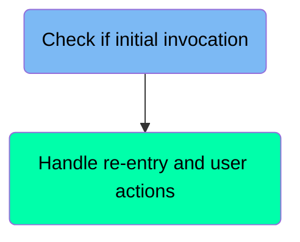
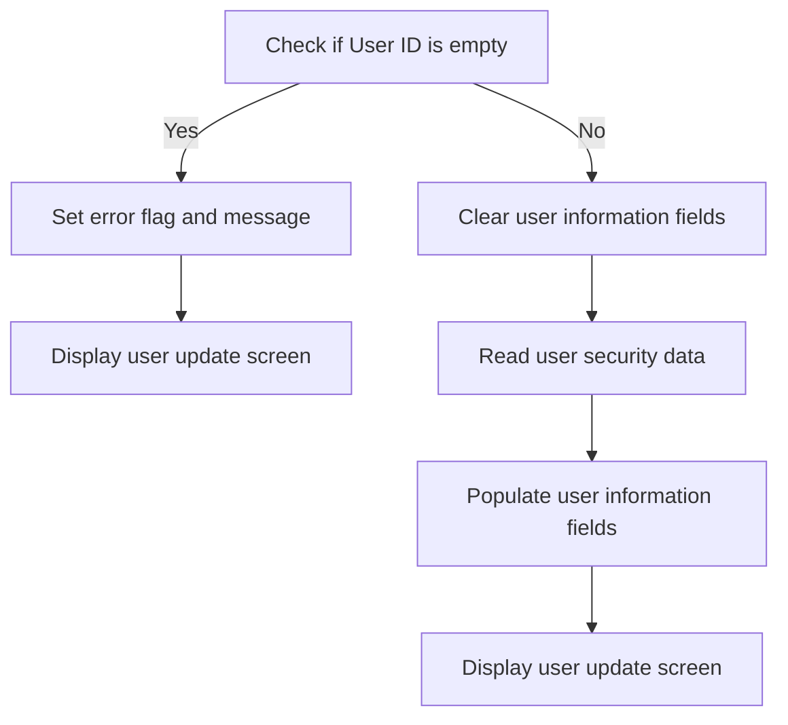
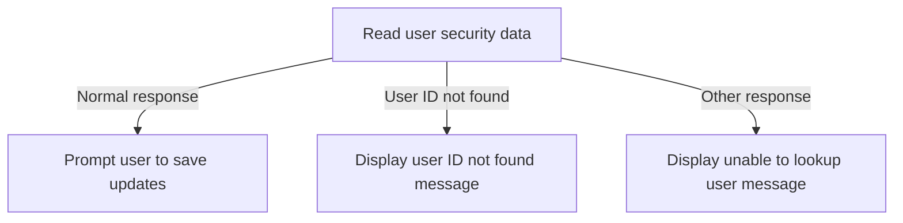

The <SwmToken path="app/cbl/COUSR02C.cbl" pos="2:7:7" line-data="      * Program     : COUSR02C.CBL">`COUSR02C`</SwmToken> program is a CICS COBOL program designed to update a user in the USRSEC file. This document details the flow of handling user input and processing user actions within the program. The program starts by checking if it is the initial invocation and handles re-entry and user actions accordingly.

For instance, if a user attempts to update their information, the program will validate the input, process the update, and return the updated user screen. If the user ID is not found, an error message will be displayed.

# Handle user input and flow (<SwmToken path="app/cbl/COUSR02C.cbl" pos="82:1:3" line-data="       MAIN-PARA.">`MAIN-PARA`</SwmToken>)

Let's split this section into smaller parts:



## Check if initial invocation

<SwmSnippet path="/app/cbl/COUSR02C.cbl" line="90">

---

### Handling missing communication area

Going into the snippet, the code checks if the communication area length (<SwmToken path="app/cbl/COUSR02C.cbl" pos="90:3:3" line-data="           IF EIBCALEN = 0">`EIBCALEN`</SwmToken>) is zero. If it is, it sets the next program to be executed to <SwmToken path="app/cbl/COUSR02C.cbl" pos="91:4:4" line-data="               MOVE &#39;COSGN00C&#39; TO CDEMO-TO-PROGRAM">`COSGN00C`</SwmToken>, which handles sign-on operations. Then, it performs the <SwmToken path="app/cbl/COUSR02C.cbl" pos="92:3:9" line-data="               PERFORM RETURN-TO-PREV-SCREEN">`RETURN-TO-PREV-SCREEN`</SwmToken> operation to return to the previous screen in the application sequence.

```cobol
           IF EIBCALEN = 0
               MOVE 'COSGN00C' TO CDEMO-TO-PROGRAM
               PERFORM RETURN-TO-PREV-SCREEN
```

---

</SwmSnippet>

## Handle re-entry and user actions

Now, lets zoom into this section of the flow:

```mermaid
graph TD
  A[Check if EIBCALEN is 0] -->|Yes| B[Set next program to COSGN00C]
  A -->|No| C[Move DFHCOMMAREA to CARDDEMO-COMMAREA]
  C --> D[Check if program is not re-entered]
  D -->|Yes| E[Set re-enter flag to true]
  E --> F[Initialize user data fields]
  F --> G[Check if user is selected]
  G -->|Yes| H[Move selected user to input field]
  H --> I[Process enter key]
  I --> J[Send user update screen]
  D -->|No| K[Receive user update screen]
  K --> L[Evaluate user action]
  L -->|Enter key| M[Process enter key]
  L -->|PF3 key| N[Update user info]
  N --> O[Set next program to COADM01C or previous program]
  O --> P[Return to previous screen]
  L -->|PF4 key| Q[Clear current screen]
  L -->|PF5 key| R[Update user info]
  L -->|PF12 key| S[Set next program to COADM01C]
  S --> T[Return to previous screen]
  L -->|Other keys| U[Set error flag]
  U --> V[Set invalid key message]
  V --> W[Send user update screen]

%% Swimm:
%% graph TD
%%   A[Check if EIBCALEN is 0] -->|Yes| B[Set next program to <SwmToken path="app/cbl/COUSR02C.cbl" pos="91:4:4" line-data="               MOVE &#39;COSGN00C&#39; TO CDEMO-TO-PROGRAM">`COSGN00C`</SwmToken>]
%%   A -->|No| C[Move DFHCOMMAREA to <SwmToken path="app/cbl/COUSR02C.cbl" pos="94:12:14" line-data="               MOVE DFHCOMMAREA(1:EIBCALEN) TO CARDDEMO-COMMAREA">`CARDDEMO-COMMAREA`</SwmToken>]
%%   C --> D[Check if program is not re-entered]
%%   D -->|Yes| E[Set re-enter flag to true]
%%   E --> F[Initialize user data fields]
%%   F --> G[Check if user is selected]
%%   G -->|Yes| H[Move selected user to input field]
%%   H --> I[Process enter key]
%%   I --> J[Send user update screen]
%%   D -->|No| K[Receive user update screen]
%%   K --> L[Evaluate user action]
%%   L -->|Enter key| M[Process enter key]
%%   L -->|PF3 key| N[Update user info]
%%   N --> O[Set next program to <SwmToken path="app/cbl/COUSR02C.cbl" pos="114:4:4" line-data="                               MOVE &#39;COADM01C&#39; TO CDEMO-TO-PROGRAM">`COADM01C`</SwmToken> or previous program]
%%   O --> P[Return to previous screen]
%%   L -->|PF4 key| Q[Clear current screen]
%%   L -->|<SwmToken path="app/cbl/COUSR02C.cbl" pos="336:6:6" line-data="                   MOVE &#39;Press PF5 key to save your updates ...&#39; TO">`PF5`</SwmToken> key| R[Update user info]
%%   L -->|PF12 key| S[Set next program to <SwmToken path="app/cbl/COUSR02C.cbl" pos="114:4:4" line-data="                               MOVE &#39;COADM01C&#39; TO CDEMO-TO-PROGRAM">`COADM01C`</SwmToken>]
%%   S --> T[Return to previous screen]
%%   L -->|Other keys| U[Set error flag]
%%   U --> V[Set invalid key message]
%%   V --> W[Send user update screen]
```



<SwmSnippet path="/app/cbl/COUSR02C.cbl" line="93">

---

### Handling re-entry and user selection

Going into the snippet, the code first checks if the program is being re-entered. If not, it sets the re-enter flag to true and initializes user data fields. Then, it checks if a user has been selected. If a user is selected, it processes the enter key and sends the user update screen.

```cobol
           ELSE
               MOVE DFHCOMMAREA(1:EIBCALEN) TO CARDDEMO-COMMAREA
               IF NOT CDEMO-PGM-REENTER
                   SET CDEMO-PGM-REENTER    TO TRUE
                   MOVE LOW-VALUES          TO COUSR2AO
                   MOVE -1       TO USRIDINL OF COUSR2AI
                   IF CDEMO-CU02-USR-SELECTED NOT =
                                              SPACES AND LOW-VALUES
                       MOVE CDEMO-CU02-USR-SELECTED TO
                            USRIDINI OF COUSR2AI
                       PERFORM PROCESS-ENTER-KEY
                   END-IF
                   PERFORM SEND-USRUPD-SCREEN
```

---

</SwmSnippet>

<SwmSnippet path="/app/cbl/COUSR02C.cbl" line="106">

---

### Receiving user update screen data

Now, the code handles the scenario where the program is re-entered. It receives the user update screen data to continue processing the user's input.

```cobol
               ELSE
                   PERFORM RECEIVE-USRUPD-SCREEN
```

---

</SwmSnippet>

<SwmSnippet path="/app/cbl/COUSR02C.cbl" line="108">

---

### Evaluating user actions

Next, the code evaluates the user action based on the input received. If the enter key is pressed, it processes the enter key to handle the user's input.

```cobol
                   EVALUATE EIBAID
                       WHEN DFHENTER
                           PERFORM PROCESS-ENTER-KEY
```

---

</SwmSnippet>

<SwmSnippet path="/app/cbl/COUSR02C.cbl" line="111">

---

### Handling PF3 key press

Then, the code handles the scenario where the PF3 key is pressed. It updates the user information and sets the next program to either the administrative functions program or the previous program. Finally, it returns to the previous screen.

```cobol
                       WHEN DFHPF3
                           PERFORM UPDATE-USER-INFO
                           IF CDEMO-FROM-PROGRAM = SPACES OR LOW-VALUES
                               MOVE 'COADM01C' TO CDEMO-TO-PROGRAM
                           ELSE
                               MOVE CDEMO-FROM-PROGRAM TO
                               CDEMO-TO-PROGRAM
                           END-IF
                           PERFORM RETURN-TO-PREV-SCREEN
```

---

</SwmSnippet>

<SwmSnippet path="/app/cbl/COUSR02C.cbl" line="120">

---

### Handling other PF key presses

Moving to the next snippet, the code handles other PF key presses. If the PF4 key is pressed, it clears the current screen. If the <SwmToken path="app/cbl/COUSR02C.cbl" pos="336:6:6" line-data="                   MOVE &#39;Press PF5 key to save your updates ...&#39; TO">`PF5`</SwmToken> key is pressed, it updates the user information. If the PF12 key is pressed, it sets the next program to the administrative functions program and returns to the previous screen.

```cobol
                       WHEN DFHPF4
                           PERFORM CLEAR-CURRENT-SCREEN
                       WHEN DFHPF5
                           PERFORM UPDATE-USER-INFO
                       WHEN DFHPF12
                           MOVE 'COADM01C' TO CDEMO-TO-PROGRAM
                           PERFORM RETURN-TO-PREV-SCREEN
```

---

</SwmSnippet>

<SwmSnippet path="/app/cbl/COUSR02C.cbl" line="127">

---

### Handling invalid key presses

Finally, the code handles invalid key presses. It sets an error flag and an invalid key message, then sends the user update screen to inform the user of the invalid input.

```cobol
                       WHEN OTHER
                           MOVE 'Y'                       TO WS-ERR-FLG
                           MOVE CCDA-MSG-INVALID-KEY      TO WS-MESSAGE
                           PERFORM SEND-USRUPD-SCREEN
                   END-EVALUATE
```

---

</SwmSnippet>

# Return to Previous Screen (<SwmToken path="app/cbl/COUSR02C.cbl" pos="92:3:9" line-data="               PERFORM RETURN-TO-PREV-SCREEN">`RETURN-TO-PREV-SCREEN`</SwmToken>)

<SwmSnippet path="/app/cbl/COUSR02C.cbl" line="250">

---

Going into the <SwmToken path="app/cbl/COUSR02C.cbl" pos="250:1:7" line-data="       RETURN-TO-PREV-SCREEN.">`RETURN-TO-PREV-SCREEN`</SwmToken> function, the code first checks if <SwmToken path="app/cbl/COUSR02C.cbl" pos="252:3:7" line-data="           IF CDEMO-TO-PROGRAM = LOW-VALUES OR SPACES">`CDEMO-TO-PROGRAM`</SwmToken> is either uninitialized or empty. If it is, it sets <SwmToken path="app/cbl/COUSR02C.cbl" pos="252:3:7" line-data="           IF CDEMO-TO-PROGRAM = LOW-VALUES OR SPACES">`CDEMO-TO-PROGRAM`</SwmToken> to <SwmToken path="app/cbl/COUSR02C.cbl" pos="253:4:4" line-data="               MOVE &#39;COSGN00C&#39; TO CDEMO-TO-PROGRAM">`COSGN00C`</SwmToken>, which refers to the sign-on operations program.

```cobol
       RETURN-TO-PREV-SCREEN.

           IF CDEMO-TO-PROGRAM = LOW-VALUES OR SPACES
               MOVE 'COSGN00C' TO CDEMO-TO-PROGRAM
           END-IF
```

---

</SwmSnippet>

<SwmSnippet path="/app/cbl/COUSR02C.cbl" line="255">

---

Next, the function sets <SwmToken path="app/cbl/COUSR02C.cbl" pos="255:9:13" line-data="           MOVE WS-TRANID    TO CDEMO-FROM-TRANID">`CDEMO-FROM-TRANID`</SwmToken> to the current transaction ID and <SwmToken path="app/cbl/COUSR02C.cbl" pos="256:9:13" line-data="           MOVE WS-PGMNAME   TO CDEMO-FROM-PROGRAM">`CDEMO-FROM-PROGRAM`</SwmToken> to the current program name. It then resets the program context to zero. Finally, it transfers control to the program specified in <SwmToken path="app/cbl/COUSR02C.cbl" pos="259:5:9" line-data="               XCTL PROGRAM(CDEMO-TO-PROGRAM)">`CDEMO-TO-PROGRAM`</SwmToken>, passing along the communication area.

```cobol
           MOVE WS-TRANID    TO CDEMO-FROM-TRANID
           MOVE WS-PGMNAME   TO CDEMO-FROM-PROGRAM
           MOVE ZEROS        TO CDEMO-PGM-CONTEXT
           EXEC CICS
               XCTL PROGRAM(CDEMO-TO-PROGRAM)
               COMMAREA(CARDDEMO-COMMAREA)
           END-EXEC.
```

---

</SwmSnippet>

# Update User (<SwmToken path="app/cbl/COUSR02C.cbl" pos="103:3:7" line-data="                       PERFORM PROCESS-ENTER-KEY">`PROCESS-ENTER-KEY`</SwmToken>)

Lets' zoom into the program flow:



<SwmSnippet path="/app/cbl/COUSR02C.cbl" line="143">

---

### Checking User ID

Going into the first snippet, the code checks if the user ID is empty or invalid. If it is, an error flag is set, and an appropriate message is displayed to the user. The user update screen is then shown with this error message.

```cobol
       PROCESS-ENTER-KEY.

           EVALUATE TRUE
               WHEN USRIDINI OF COUSR2AI = SPACES OR LOW-VALUES
                   MOVE 'Y'     TO WS-ERR-FLG
                   MOVE 'User ID can NOT be empty...' TO
                                   WS-MESSAGE
                   MOVE -1       TO USRIDINL OF COUSR2AI
                   PERFORM SEND-USRUPD-SCREEN
               WHEN OTHER
                   MOVE -1       TO USRIDINL OF COUSR2AI
                   CONTINUE
           END-EVALUATE
```

---

</SwmSnippet>

<SwmSnippet path="/app/cbl/COUSR02C.cbl" line="157">

---

### Clearing User Information Fields

Now, if there is no error, the code clears the user information fields and reads the user security data from the file. This step ensures that the user information is up-to-date and accurate.

```cobol
           IF NOT ERR-FLG-ON
               MOVE SPACES      TO FNAMEI   OF COUSR2AI
                                   LNAMEI   OF COUSR2AI
                                   PASSWDI  OF COUSR2AI
                                   USRTYPEI OF COUSR2AI
               MOVE USRIDINI  OF COUSR2AI TO SEC-USR-ID
               PERFORM READ-USER-SEC-FILE
           END-IF.
```

---

</SwmSnippet>

<SwmSnippet path="/app/cbl/COUSR02C.cbl" line="166">

---

### Populating User Information Fields

Next, if there is still no error, the code populates the user information fields with the data retrieved from the user security file. The user update screen is then displayed with the updated information.

```cobol
           IF NOT ERR-FLG-ON
               MOVE SEC-USR-FNAME      TO FNAMEI    OF COUSR2AI
               MOVE SEC-USR-LNAME      TO LNAMEI    OF COUSR2AI
               MOVE SEC-USR-PWD        TO PASSWDI   OF COUSR2AI
               MOVE SEC-USR-TYPE       TO USRTYPEI  OF COUSR2AI
               PERFORM SEND-USRUPD-SCREEN
           END-IF.
```

---

</SwmSnippet>

# Display User Update Screen (<SwmToken path="app/cbl/COUSR02C.cbl" pos="105:3:7" line-data="                   PERFORM SEND-USRUPD-SCREEN">`SEND-USRUPD-SCREEN`</SwmToken>)

<SwmSnippet path="/app/cbl/COUSR02C.cbl" line="266">

---

### Populating header information

Going into the <SwmToken path="app/cbl/COUSR02C.cbl" pos="266:1:5" line-data="       SEND-USRUPD-SCREEN.">`SEND-USRUPD-SCREEN`</SwmToken> function, the first step is to perform the <SwmToken path="app/cbl/COUSR02C.cbl" pos="268:3:7" line-data="           PERFORM POPULATE-HEADER-INFO">`POPULATE-HEADER-INFO`</SwmToken> routine. This routine formats and updates the current date and time for display purposes, ensuring that the header information is accurate and up-to-date.

```cobol
       SEND-USRUPD-SCREEN.

           PERFORM POPULATE-HEADER-INFO
```

---

</SwmSnippet>

<SwmSnippet path="/app/cbl/COUSR02C.cbl" line="270">

---

### Sending the user update screen

Next, the function moves the <SwmToken path="app/cbl/COUSR02C.cbl" pos="270:3:5" line-data="           MOVE WS-MESSAGE TO ERRMSGO OF COUSR2AO">`WS-MESSAGE`</SwmToken> (which stores various messages like prompts for user ID or password) to the <SwmToken path="app/cbl/COUSR02C.cbl" pos="270:9:9" line-data="           MOVE WS-MESSAGE TO ERRMSGO OF COUSR2AO">`ERRMSGO`</SwmToken> field of <SwmToken path="app/cbl/COUSR02C.cbl" pos="270:13:13" line-data="           MOVE WS-MESSAGE TO ERRMSGO OF COUSR2AO">`COUSR2AO`</SwmToken>. Then, it sends the <SwmToken path="app/cbl/COUSR02C.cbl" pos="273:4:4" line-data="                     MAP(&#39;COUSR2A&#39;)">`COUSR2A`</SwmToken> map from the <SwmToken path="app/cbl/COUSR02C.cbl" pos="274:4:4" line-data="                     MAPSET(&#39;COUSR02&#39;)">`COUSR02`</SwmToken> mapset to the screen, erasing the previous content and positioning the cursor at the beginning. This ensures that the user sees the updated information and any relevant messages clearly.

```cobol
           MOVE WS-MESSAGE TO ERRMSGO OF COUSR2AO

           EXEC CICS SEND
                     MAP('COUSR2A')
                     MAPSET('COUSR02')
                     FROM(COUSR2AO)
                     ERASE
                     CURSOR
           END-EXEC.
```

---

</SwmSnippet>

# Populate Header Info (<SwmToken path="app/cbl/COUSR02C.cbl" pos="268:3:7" line-data="           PERFORM POPULATE-HEADER-INFO">`POPULATE-HEADER-INFO`</SwmToken>)

<SwmSnippet path="/app/cbl/COUSR02C.cbl" line="296">

---

### Populating Header Information

The <SwmToken path="app/cbl/COUSR02C.cbl" pos="296:1:5" line-data="       POPULATE-HEADER-INFO.">`POPULATE-HEADER-INFO`</SwmToken> function starts by obtaining the current date. It then updates the header titles and transaction details to ensure they are current. The function formats the current date and time, breaking them down into month, day, year, hours, minutes, and seconds. These formatted values are then updated in the header to ensure the information is up-to-date.

```cobol
       POPULATE-HEADER-INFO.

           MOVE FUNCTION CURRENT-DATE  TO WS-CURDATE-DATA

           MOVE CCDA-TITLE01           TO TITLE01O OF COUSR2AO
           MOVE CCDA-TITLE02           TO TITLE02O OF COUSR2AO
           MOVE WS-TRANID              TO TRNNAMEO OF COUSR2AO
           MOVE WS-PGMNAME             TO PGMNAMEO OF COUSR2AO

           MOVE WS-CURDATE-MONTH       TO WS-CURDATE-MM
           MOVE WS-CURDATE-DAY         TO WS-CURDATE-DD
           MOVE WS-CURDATE-YEAR(3:2)   TO WS-CURDATE-YY

           MOVE WS-CURDATE-MM-DD-YY    TO CURDATEO OF COUSR2AO

           MOVE WS-CURTIME-HOURS       TO WS-CURTIME-HH
           MOVE WS-CURTIME-MINUTE      TO WS-CURTIME-MM
           MOVE WS-CURTIME-SECOND      TO WS-CURTIME-SS

           MOVE WS-CURTIME-HH-MM-SS    TO CURTIMEO OF COUSR2AO.
```

---

</SwmSnippet>

# Read User Security Data (<SwmToken path="app/cbl/COUSR02C.cbl" pos="163:3:9" line-data="               PERFORM READ-USER-SEC-FILE">`READ-USER-SEC-FILE`</SwmToken>)

Lets' zoom into the program flow:



<SwmSnippet path="/app/cbl/COUSR02C.cbl" line="320">

---

### Reading user security data

Going into the function, the code reads the user security data from the file using the user ID to locate the specific record and stores the data for further processing. The response codes capture the outcome of this read operation.

```cobol
       READ-USER-SEC-FILE.

           EXEC CICS READ
                DATASET   (WS-USRSEC-FILE)
                INTO      (SEC-USER-DATA)
                LENGTH    (LENGTH OF SEC-USER-DATA)
                RIDFLD    (SEC-USR-ID)
                KEYLENGTH (LENGTH OF SEC-USR-ID)
                UPDATE
                RESP      (WS-RESP-CD)
                RESP2     (WS-REAS-CD)
           END-EXEC.
```

---

</SwmSnippet>

<SwmSnippet path="/app/cbl/COUSR02C.cbl" line="333">

---

### Handling normal response

Now, if the response code indicates a normal response, the user is prompted to save their updates with a message displayed on the screen, guiding them to press a specific key to proceed.

```cobol
           EVALUATE WS-RESP-CD
               WHEN DFHRESP(NORMAL)
                   CONTINUE
                   MOVE 'Press PF5 key to save your updates ...' TO
                                   WS-MESSAGE
                   MOVE DFHNEUTR       TO ERRMSGC  OF COUSR2AO
                   PERFORM SEND-USRUPD-SCREEN
```

---

</SwmSnippet>

<SwmSnippet path="/app/cbl/COUSR02C.cbl" line="340">

---

### Handling user ID not found

Next, if the user ID is not found, an error flag is set, and a message is displayed to inform the user that the user ID was not found. The screen is then updated to reflect this error, guiding the user on the next steps.

```cobol
               WHEN DFHRESP(NOTFND)
                   MOVE 'Y'     TO WS-ERR-FLG
                   MOVE 'User ID NOT found...' TO
                                   WS-MESSAGE
                   MOVE -1       TO USRIDINL OF COUSR2AI
                   PERFORM SEND-USRUPD-SCREEN
```

---

</SwmSnippet>

<SwmSnippet path="/app/cbl/COUSR02C.cbl" line="346">

---

### Handling other responses

Then, for any other response, the response and reason codes are displayed, an error flag is set, and a message is shown to the user indicating that the lookup was unsuccessful. The screen is updated to reflect this issue, providing the user with information on the failure.

```cobol
               WHEN OTHER
                   DISPLAY 'RESP:' WS-RESP-CD 'REAS:' WS-REAS-CD
                   MOVE 'Y'     TO WS-ERR-FLG
                   MOVE 'Unable to lookup User...' TO
                                   WS-MESSAGE
                   MOVE -1       TO FNAMEL OF COUSR2AI
                   PERFORM SEND-USRUPD-SCREEN
           END-EVALUATE.
```

---

</SwmSnippet>

# Receive User Update Screen (<SwmToken path="app/cbl/COUSR02C.cbl" pos="107:3:7" line-data="                   PERFORM RECEIVE-USRUPD-SCREEN">`RECEIVE-USRUPD-SCREEN`</SwmToken>)

<SwmSnippet path="/app/cbl/COUSR02C.cbl" line="283">

---

### Receiving user update screen data

Going into the <SwmToken path="app/cbl/COUSR02C.cbl" pos="283:1:5" line-data="       RECEIVE-USRUPD-SCREEN.">`RECEIVE-USRUPD-SCREEN`</SwmToken> function, it starts by receiving the user update screen data. The function captures the data from the user interface, specifically from the user update screen map within the mapset. This data is then stored into a structure for further processing. Response codes are used to handle any potential issues during the data reception.

```cobol
       RECEIVE-USRUPD-SCREEN.

           EXEC CICS RECEIVE
                     MAP('COUSR2A')
                     MAPSET('COUSR02')
                     INTO(COUSR2AI)
                     RESP(WS-RESP-CD)
                     RESP2(WS-REAS-CD)
           END-EXEC.
```

---

</SwmSnippet>

&nbsp;

*This is an auto-generated document by Swimm 🌊 and has not yet been verified by a human*

<SwmMeta version="3.0.0" repo-id="Z2l0aHViJTNBJTNBa3luZHJ5bC1hd3MtbWFpbmZyYW1lLW1vZGVybml6YXRpb24tY2FyZGRlbW8lM0ElM0FTd2ltbS1EZW1v" repo-name="kyndryl-aws-mainframe-modernization-carddemo"><sup>Powered by [Swimm](/)</sup></SwmMeta>
