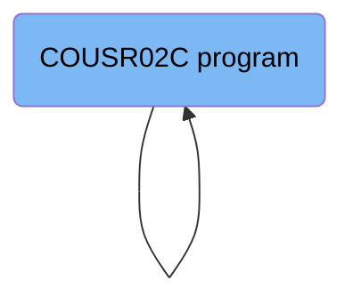
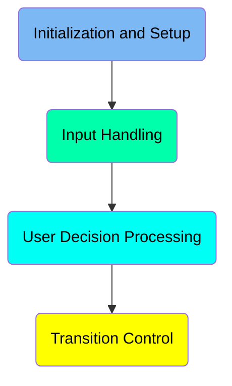
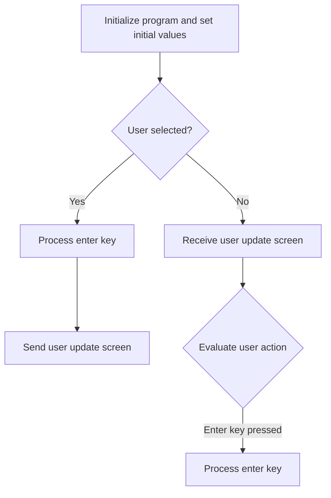
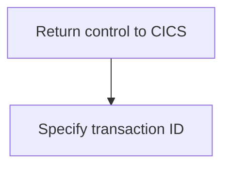

The document describes the flow of updating user data in the <SwmToken path="app/cbl/COUSR02C.cbl" pos="3:7:7" line-data="      * Application : CardDemo">`CardDemo`</SwmToken> application using the <SwmToken path="app/cbl/COUSR02C.cbl" pos="2:7:7" line-data="      * Program     : COUSR02C.CBL">`COUSR02C`</SwmToken> program. The program is responsible for handling user input, processing user decisions, and updating the user information in the USRSEC file. This is achieved through a series of steps including initialization, input handling, decision processing, and transition control.

The flow involves initializing the program, handling user input to determine the selected user, processing the user's decision based on the key pressed, and updating the user information accordingly. Finally, the program returns control to CICS with the specified transaction ID.

# Where is this program used?

This program is used once, in a flow starting from <SwmToken path="app/cbl/COUSR02C.cbl" pos="2:7:7" line-data="      * Program     : COUSR02C.CBL">`COUSR02C`</SwmToken> as represented in the following diagram:



Here is a high level diagram of the program:



## Initialization and Setup

First, we'll zoom into this section of the flow:

```mermaid
graph TD
  A[Set error flag to off] --> B[Set user modified flag to true]
  B --> C[Clear message field]
  C --> D{Is communication area length zero?}
  D -->|Yes| E[Set target program to COSGN00C]
  E --> F[Return to previous screen]

%% Swimm:
%% graph TD
%%   A[Set error flag to off] --> B[Set user modified flag to true]
%%   B --> C[Clear message field]
%%   C --> D{Is communication area length zero?}
%%   D -->|Yes| E[Set target program to <SwmToken path="app/cbl/COUSR02C.cbl" pos="91:4:4" line-data="               MOVE &#39;COSGN00C&#39; TO CDEMO-TO-PROGRAM">`COSGN00C`</SwmToken>]
%%   E --> F[Return to previous screen]
```



First, the error flag is set to off, indicating that there are no errors at the start of the process. This ensures that any subsequent operations are not hindered by previous error states.

## Input Handling

Now, lets zoom into this section of the flow:



<SwmSnippet path="/app/cbl/COUSR02C.cbl" line="94">

---

First, the program initializes by moving the communication area to <SwmToken path="app/cbl/COUSR02C.cbl" pos="94:12:14" line-data="               MOVE DFHCOMMAREA(1:EIBCALEN) TO CARDDEMO-COMMAREA">`CARDDEMO-COMMAREA`</SwmToken> and setting the <SwmToken path="app/cbl/COUSR02C.cbl" pos="95:5:9" line-data="               IF NOT CDEMO-PGM-REENTER">`CDEMO-PGM-REENTER`</SwmToken> flag to true. This ensures that the program is ready for re-entry and initializes necessary variables.

```cobol
               MOVE DFHCOMMAREA(1:EIBCALEN) TO CARDDEMO-COMMAREA
               IF NOT CDEMO-PGM-REENTER
                   SET CDEMO-PGM-REENTER    TO TRUE
                   MOVE LOW-VALUES          TO COUSR2AO
```

---

</SwmSnippet>

<SwmSnippet path="/app/cbl/COUSR02C.cbl" line="98">

---

Next, the program checks if a user has been selected by evaluating <SwmToken path="app/cbl/COUSR02C.cbl" pos="99:3:9" line-data="                   IF CDEMO-CU02-USR-SELECTED NOT =">`CDEMO-CU02-USR-SELECTED`</SwmToken>. If a user is selected, it processes the enter key and sends the user update screen to the terminal. If no user is selected, it receives the user update screen from the terminal and evaluates the user action based on the input received.

```cobol
                   MOVE -1       TO USRIDINL OF COUSR2AI
                   IF CDEMO-CU02-USR-SELECTED NOT =
                                              SPACES AND LOW-VALUES
                       MOVE CDEMO-CU02-USR-SELECTED TO
                            USRIDINI OF COUSR2AI
                       PERFORM PROCESS-ENTER-KEY
                   END-IF
                   PERFORM SEND-USRUPD-SCREEN
               ELSE
                   PERFORM RECEIVE-USRUPD-SCREEN
                   EVALUATE EIBAID
                       WHEN DFHENTER
```

---

</SwmSnippet>

## Interim Summary

So far, we saw how the program initializes and handles user input, ensuring that the necessary variables are set and the user update screen is processed based on the user's actions. This includes setting up the communication area and evaluating whether a user has been selected. Now, we will focus on the user decision processing, where the program determines the user's action based on the key pressed and updates the user information accordingly.

## User Decision Processing

Now, lets zoom into this section of the flow:



```mermaid
graph TD
  A[Process Enter Key Input] --> B{Key Pressed}
  B -->|F3| C[Update User Information]
  C --> D{From Program is Empty or Low Values}
  D -->|Yes| E[Set Target Program to COADM01C]
  D -->|No| F[Set Target Program to From Program]
  F --> G[Return to Previous Screen]
  B -->|F4| H[Clear Current Screen]
  B -->|F5| I[Update User Information]
  B -->|F12| J[Set Target Program to COADM01C]
  J --> K[Return to Previous Screen]
  B -->|Other| L[Set Error Flag and Display Error Message]

%% Swimm:
%% graph TD
%%   A[Process Enter Key Input] --> B{Key Pressed}
%%   B -->|F3| C[Update User Information]
%%   C --> D{From Program is Empty or Low Values}
%%   D -->|Yes| E[Set Target Program to <SwmToken path="app/cbl/COUSR02C.cbl" pos="114:4:4" line-data="                               MOVE &#39;COADM01C&#39; TO CDEMO-TO-PROGRAM">`COADM01C`</SwmToken>]
%%   D -->|No| F[Set Target Program to From Program]
%%   F --> G[Return to Previous Screen]
%%   B -->|F4| H[Clear Current Screen]
%%   B -->|F5| I[Update User Information]
%%   B -->|F12| J[Set Target Program to <SwmToken path="app/cbl/COUSR02C.cbl" pos="114:4:4" line-data="                               MOVE &#39;COADM01C&#39; TO CDEMO-TO-PROGRAM">`COADM01C`</SwmToken>]
%%   J --> K[Return to Previous Screen]
%%   B -->|Other| L[Set Error Flag and Display Error Message]
```

First, the program processes the enter key input to determine the user's action.

Moving to the next step, if the F3 key is pressed, the program updates the user information and checks if the <SwmToken path="app/cbl/COUSR02C.cbl" pos="113:3:7" line-data="                           IF CDEMO-FROM-PROGRAM = SPACES OR LOW-VALUES">`CDEMO-FROM-PROGRAM`</SwmToken> (the current program) is empty or contains low values. If it is, the target program is set to <SwmToken path="app/cbl/COUSR02C.cbl" pos="114:4:4" line-data="                               MOVE &#39;COADM01C&#39; TO CDEMO-TO-PROGRAM">`COADM01C`</SwmToken>. Otherwise, the target program is set to the current program. The program then returns to the previous screen.

## Transition Control

Now, lets zoom into this section of the flow:



&nbsp;

*This is an auto-generated document by Swimm 🌊 and has not yet been verified by a human*

<SwmMeta version="3.0.0" repo-id="Z2l0aHViJTNBJTNBa3luZHJ5bC1hd3MtbWFpbmZyYW1lLW1vZGVybml6YXRpb24tY2FyZGRlbW8lM0ElM0FTd2ltbS1EZW1v" repo-name="kyndryl-aws-mainframe-modernization-carddemo"><sup>Powered by [Swimm](/)</sup></SwmMeta>
