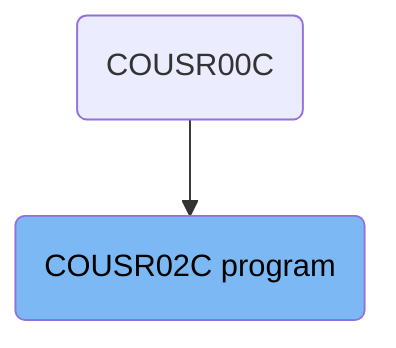
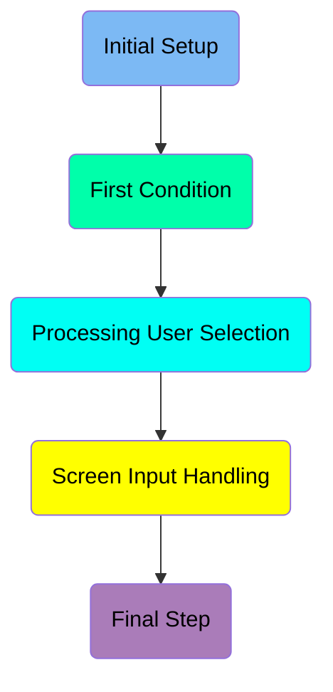
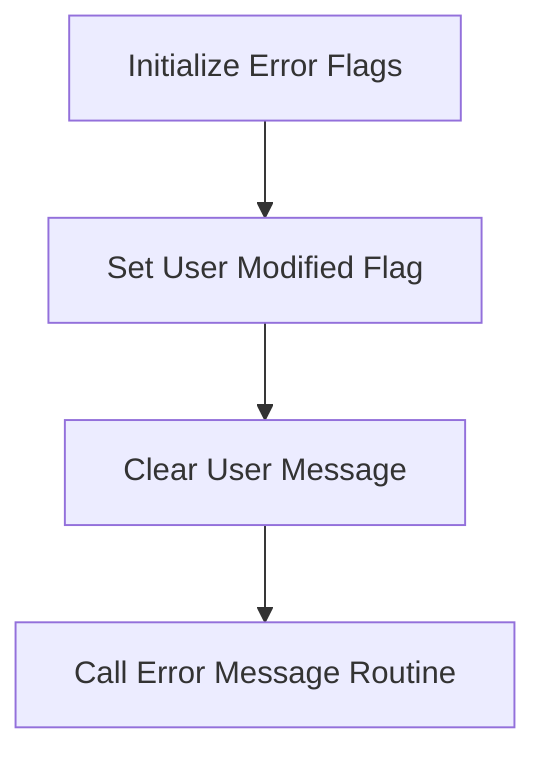
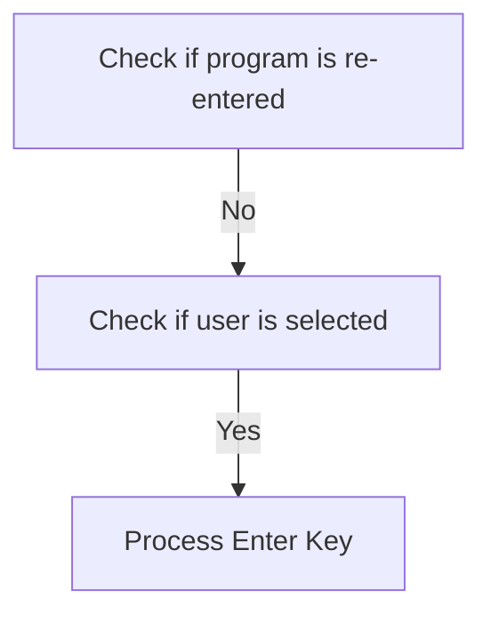
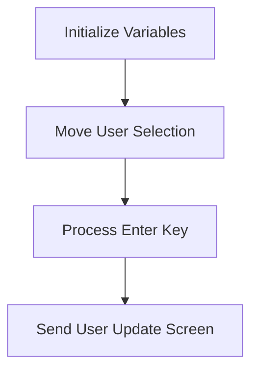
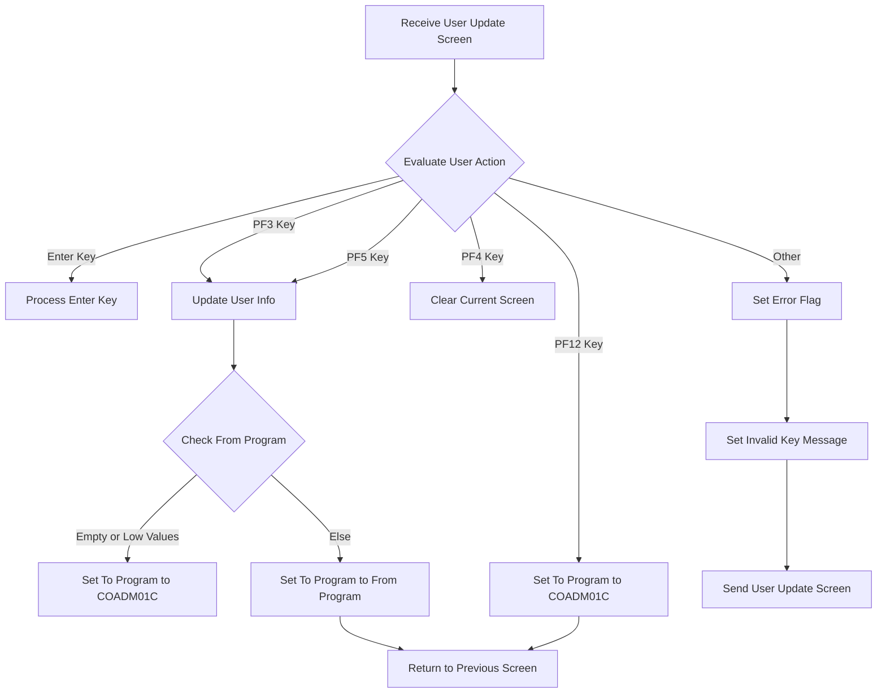
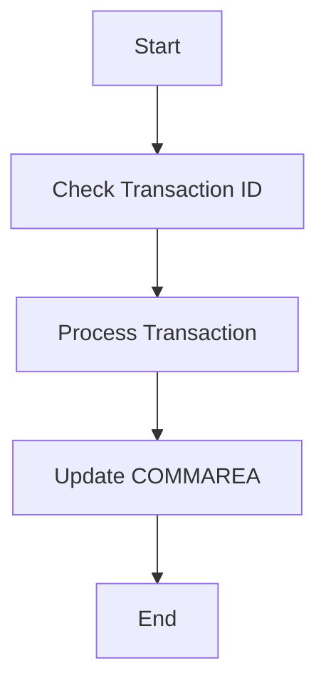

The <SwmToken path="app/cbl/COUSR02C.cbl" pos="2:7:7" line-data="      * Program     : COUSR02C.CBL">`COUSR02C`</SwmToken> program is responsible for handling user interactions and updating user information in the system. It achieves this by initializing error flags, processing user input, and managing screen updates based on user actions.

The <SwmToken path="app/cbl/COUSR02C.cbl" pos="2:7:7" line-data="      * Program     : COUSR02C.CBL">`COUSR02C`</SwmToken> program starts by setting up error flags and clearing any previous messages. It then checks if the program is being re-entered and processes user input accordingly. Depending on the key pressed by the user, it performs different actions such as updating user information, clearing the screen, or returning to the previous screen. The program ensures that all user interactions are handled smoothly and any errors are communicated back to the user.

# Where is this program used?

This program is used multiple times in the codebase as represented in the following diagram:



Here is a high level diagram of the program:



# Initial Setup



<SwmSnippet path="/app/cbl/COUSR02C.cbl" line="84">

---

## Initialize Error Flags

First, the error flag is set to off, indicating that there are no errors at the start of the program. This is done by setting <SwmToken path="app/cbl/COUSR02C.cbl" pos="84:3:7" line-data="           SET ERR-FLG-OFF     TO TRUE">`ERR-FLG-OFF`</SwmToken> to TRUE.

```cobol
           SET ERR-FLG-OFF     TO TRUE
```

---

</SwmSnippet>

<SwmSnippet path="/app/cbl/COUSR02C.cbl" line="85">

---

## Set User Modified Flag

Next, the user modified flag is set to no, indicating that the user has not made any modifications yet. This is done by setting <SwmToken path="app/cbl/COUSR02C.cbl" pos="85:3:7" line-data="           SET USR-MODIFIED-NO TO TRUE">`USR-MODIFIED-NO`</SwmToken> to TRUE.

```cobol
           SET USR-MODIFIED-NO TO TRUE
```

---

</SwmSnippet>

<SwmSnippet path="/app/cbl/COUSR02C.cbl" line="87">

---

## Clear User Message

Then, the workspace message is cleared by moving spaces to <SwmToken path="app/cbl/COUSR02C.cbl" pos="87:7:9" line-data="           MOVE SPACES TO WS-MESSAGE">`WS-MESSAGE`</SwmToken>. This ensures that there are no residual messages from previous operations.

```cobol
           MOVE SPACES TO WS-MESSAGE
```

---

</SwmSnippet>

<SwmSnippet path="/app/cbl/COUSR02C.cbl" line="88">

---

## Call Error Message Routine

Finally, the error message routine <SwmToken path="app/cbl/COUSR02C.cbl" pos="88:1:1" line-data="                          ERRMSGO OF COUSR2AO">`ERRMSGO`</SwmToken> of <SwmToken path="app/cbl/COUSR02C.cbl" pos="88:5:5" line-data="                          ERRMSGO OF COUSR2AO">`COUSR2AO`</SwmToken> is called. This routine handles any error messages that need to be displayed to the user.

```cobol
                          ERRMSGO OF COUSR2AO
```

---

</SwmSnippet>

# First Condition



<SwmSnippet path="/app/cbl/COUSR02C.cbl" line="95">

---

## Check if program is re-entered

First, the code checks if the program is being re-entered by evaluating <SwmToken path="app/cbl/COUSR02C.cbl" pos="95:5:9" line-data="               IF NOT CDEMO-PGM-REENTER">`CDEMO-PGM-REENTER`</SwmToken>. If it is not re-entered, it sets <SwmToken path="app/cbl/COUSR02C.cbl" pos="95:5:9" line-data="               IF NOT CDEMO-PGM-REENTER">`CDEMO-PGM-REENTER`</SwmToken> to TRUE to indicate that the program is now in a re-entered state.

```cobol
               IF NOT CDEMO-PGM-REENTER
                   SET CDEMO-PGM-REENTER    TO TRUE
```

---

</SwmSnippet>

<SwmSnippet path="/app/cbl/COUSR02C.cbl" line="97">

---

## Check if user is selected

Next, the code checks if a user has been selected by evaluating <SwmToken path="app/cbl/COUSR02C.cbl" pos="101:3:9" line-data="                       MOVE CDEMO-CU02-USR-SELECTED TO">`CDEMO-CU02-USR-SELECTED`</SwmToken>. If a user is selected, it proceeds to process the enter key action.

```cobol
                   MOVE LOW-VALUES          TO COUSR2AO
                   MOVE -1       TO USRIDINL OF COUSR2AI
```

---

</SwmSnippet>

<SwmSnippet path="/app/cbl/COUSR02C.cbl" line="143">

---

## Process Enter Key

Then, the code performs the <SwmToken path="app/cbl/COUSR02C.cbl" pos="143:1:5" line-data="       PROCESS-ENTER-KEY.">`PROCESS-ENTER-KEY`</SwmToken> paragraph. This paragraph handles the logic for processing the enter key action, including validating user input and updating user information if necessary.

```cobol
       PROCESS-ENTER-KEY.

           EVALUATE TRUE
               WHEN USRIDINI OF COUSR2AI = SPACES OR LOW-VALUES
                   MOVE 'Y'     TO WS-ERR-FLG
                   MOVE 'User ID can NOT be empty...' TO
                                   WS-MESSAGE
                   MOVE -1       TO USRIDINL OF COUSR2AI
                   PERFORM SEND-USRUPD-SCREEN
               WHEN OTHER
                   MOVE -1       TO USRIDINL OF COUSR2AI
                   CONTINUE
           END-EVALUATE

           IF NOT ERR-FLG-ON
               MOVE SPACES      TO FNAMEI   OF COUSR2AI
                                   LNAMEI   OF COUSR2AI
                                   PASSWDI  OF COUSR2AI
                                   USRTYPEI OF COUSR2AI
               MOVE USRIDINI  OF COUSR2AI TO SEC-USR-ID
               PERFORM READ-USER-SEC-FILE
```

---

</SwmSnippet>

# Processing User Selection



<SwmSnippet path="/app/cbl/COUSR02C.cbl" line="100">

---

## Initialize Variables

First, the variables are initialized to spaces and low values to ensure they are empty and ready for new data.

```cobol
                                              SPACES AND LOW-VALUES
```

---

</SwmSnippet>

<SwmSnippet path="/app/cbl/COUSR02C.cbl" line="101">

---

## Move User Selection

Next, the selected user ID is moved to the <SwmToken path="app/cbl/COUSR02C.cbl" pos="102:1:1" line-data="                            USRIDINI OF COUSR2AI">`USRIDINI`</SwmToken> field of the <SwmToken path="app/cbl/COUSR02C.cbl" pos="102:5:5" line-data="                            USRIDINI OF COUSR2AI">`COUSR2AI`</SwmToken> structure. This sets up the user ID for further processing.

```cobol
                       MOVE CDEMO-CU02-USR-SELECTED TO
                            USRIDINI OF COUSR2AI
```

---

</SwmSnippet>

<SwmSnippet path="/app/cbl/COUSR02C.cbl" line="103">

---

## Process Enter Key

Then, the <SwmToken path="app/cbl/COUSR02C.cbl" pos="103:3:7" line-data="                       PERFORM PROCESS-ENTER-KEY">`PROCESS-ENTER-KEY`</SwmToken> routine is performed. This routine handles the logic when the enter key is pressed by the user.

```cobol
                       PERFORM PROCESS-ENTER-KEY
```

---

</SwmSnippet>

<SwmSnippet path="/app/cbl/COUSR02C.cbl" line="105">

---

## Send User Update Screen

Finally, the <SwmToken path="app/cbl/COUSR02C.cbl" pos="105:3:7" line-data="                   PERFORM SEND-USRUPD-SCREEN">`SEND-USRUPD-SCREEN`</SwmToken> routine is performed to send the updated user screen to the user interface.

```cobol
                   PERFORM SEND-USRUPD-SCREEN
```

---

</SwmSnippet>

<SwmSnippet path="/app/cbl/COUSR02C.cbl" line="266">

---

### <SwmToken path="app/cbl/COUSR02C.cbl" pos="266:1:5" line-data="       SEND-USRUPD-SCREEN.">`SEND-USRUPD-SCREEN`</SwmToken>

The <SwmToken path="app/cbl/COUSR02C.cbl" pos="266:1:5" line-data="       SEND-USRUPD-SCREEN.">`SEND-USRUPD-SCREEN`</SwmToken> routine populates the header information, moves the message to the error message field, and sends the screen map to the user interface.

```cobol
       SEND-USRUPD-SCREEN.

           PERFORM POPULATE-HEADER-INFO

           MOVE WS-MESSAGE TO ERRMSGO OF COUSR2AO

           EXEC CICS SEND
                     MAP('COUSR2A')
                     MAPSET('COUSR02')
                     FROM(COUSR2AO)
                     ERASE
                     CURSOR
           END-EXEC.
```

---

</SwmSnippet>

<SwmSnippet path="/app/cbl/COUSR02C.cbl" line="283">

---

### <SwmToken path="app/cbl/COUSR02C.cbl" pos="283:1:5" line-data="       RECEIVE-USRUPD-SCREEN.">`RECEIVE-USRUPD-SCREEN`</SwmToken>

The <SwmToken path="app/cbl/COUSR02C.cbl" pos="283:1:5" line-data="       RECEIVE-USRUPD-SCREEN.">`RECEIVE-USRUPD-SCREEN`</SwmToken> routine receives the user input from the screen map and stores it in the <SwmToken path="app/cbl/COUSR02C.cbl" pos="288:3:3" line-data="                     INTO(COUSR2AI)">`COUSR2AI`</SwmToken> structure.

```cobol
       RECEIVE-USRUPD-SCREEN.

           EXEC CICS RECEIVE
                     MAP('COUSR2A')
                     MAPSET('COUSR02')
                     INTO(COUSR2AI)
                     RESP(WS-RESP-CD)
                     RESP2(WS-REAS-CD)
           END-EXEC.
```

---

</SwmSnippet>

## Interim Summary

So far, we saw the initial setup process, including initializing error flags, setting user modified flags, clearing user messages, and calling the error message routine. We also covered the first condition checks, such as checking if the program is re-entered and if a user is selected, followed by processing the enter key action. Now, we will focus on handling screen input, including receiving the user update screen and evaluating user actions based on different key presses.

# Screen Input Handling



<SwmSnippet path="/app/cbl/COUSR02C.cbl" line="107">

---

## Receiving User Update Screen

First, the flow performs the <SwmToken path="app/cbl/COUSR02C.cbl" pos="107:3:7" line-data="                   PERFORM RECEIVE-USRUPD-SCREEN">`RECEIVE-USRUPD-SCREEN`</SwmToken> to receive the user update screen input.

```cobol
                   PERFORM RECEIVE-USRUPD-SCREEN
```

---

</SwmSnippet>

<SwmSnippet path="/app/cbl/COUSR02C.cbl" line="108">

---

## Evaluating User Action

Next, the flow evaluates the user action based on the <SwmToken path="app/cbl/COUSR02C.cbl" pos="108:3:3" line-data="                   EVALUATE EIBAID">`EIBAID`</SwmToken> value. Different actions are performed based on the key pressed by the user.

```cobol
                   EVALUATE EIBAID
                       WHEN DFHENTER
                           PERFORM PROCESS-ENTER-KEY
                       WHEN DFHPF3
                           PERFORM UPDATE-USER-INFO
                           IF CDEMO-FROM-PROGRAM = SPACES OR LOW-VALUES
                               MOVE 'COADM01C' TO CDEMO-TO-PROGRAM
                           ELSE
                               MOVE CDEMO-FROM-PROGRAM TO
                               CDEMO-TO-PROGRAM
                           END-IF
                           PERFORM RETURN-TO-PREV-SCREEN
                       WHEN DFHPF4
                           PERFORM CLEAR-CURRENT-SCREEN
                       WHEN DFHPF5
                           PERFORM UPDATE-USER-INFO
                       WHEN DFHPF12
                           MOVE 'COADM01C' TO CDEMO-TO-PROGRAM
                           PERFORM RETURN-TO-PREV-SCREEN
                       WHEN OTHER
                           MOVE 'Y'                       TO WS-ERR-FLG
```

---

</SwmSnippet>

<SwmSnippet path="/app/cbl/COUSR02C.cbl" line="109">

---

### Processing Enter Key

When the Enter key is pressed (<SwmToken path="app/cbl/COUSR02C.cbl" pos="109:3:3" line-data="                       WHEN DFHENTER">`DFHENTER`</SwmToken>), the flow performs the <SwmToken path="app/cbl/COUSR02C.cbl" pos="110:3:7" line-data="                           PERFORM PROCESS-ENTER-KEY">`PROCESS-ENTER-KEY`</SwmToken> to handle the enter key action.

```cobol
                       WHEN DFHENTER
                           PERFORM PROCESS-ENTER-KEY
```

---

</SwmSnippet>

<SwmSnippet path="/app/cbl/COUSR02C.cbl" line="111">

---

### Updating User Info

When the PF3 key is pressed (<SwmToken path="app/cbl/COUSR02C.cbl" pos="111:3:3" line-data="                       WHEN DFHPF3">`DFHPF3`</SwmToken>), the flow performs the <SwmToken path="app/cbl/COUSR02C.cbl" pos="112:3:7" line-data="                           PERFORM UPDATE-USER-INFO">`UPDATE-USER-INFO`</SwmToken> to update the user information.

```cobol
                       WHEN DFHPF3
                           PERFORM UPDATE-USER-INFO
```

---

</SwmSnippet>

<SwmSnippet path="/app/cbl/COUSR02C.cbl" line="113">

---

### Checking From Program

The flow checks if <SwmToken path="app/cbl/COUSR02C.cbl" pos="113:3:7" line-data="                           IF CDEMO-FROM-PROGRAM = SPACES OR LOW-VALUES">`CDEMO-FROM-PROGRAM`</SwmToken> is empty or contains low values. If true, it sets <SwmToken path="app/cbl/COUSR02C.cbl" pos="114:9:13" line-data="                               MOVE &#39;COADM01C&#39; TO CDEMO-TO-PROGRAM">`CDEMO-TO-PROGRAM`</SwmToken> to <SwmToken path="app/cbl/COUSR02C.cbl" pos="114:4:4" line-data="                               MOVE &#39;COADM01C&#39; TO CDEMO-TO-PROGRAM">`COADM01C`</SwmToken>. Otherwise, it sets <SwmToken path="app/cbl/COUSR02C.cbl" pos="114:9:13" line-data="                               MOVE &#39;COADM01C&#39; TO CDEMO-TO-PROGRAM">`CDEMO-TO-PROGRAM`</SwmToken> to <SwmToken path="app/cbl/COUSR02C.cbl" pos="113:3:7" line-data="                           IF CDEMO-FROM-PROGRAM = SPACES OR LOW-VALUES">`CDEMO-FROM-PROGRAM`</SwmToken>.

```cobol
                           IF CDEMO-FROM-PROGRAM = SPACES OR LOW-VALUES
                               MOVE 'COADM01C' TO CDEMO-TO-PROGRAM
                           ELSE
                               MOVE CDEMO-FROM-PROGRAM TO
                               CDEMO-TO-PROGRAM
                           END-IF
```

---

</SwmSnippet>

<SwmSnippet path="/app/cbl/COUSR02C.cbl" line="119">

---

### Returning to Previous Screen

After updating the user info, the flow performs the <SwmToken path="app/cbl/COUSR02C.cbl" pos="119:3:9" line-data="                           PERFORM RETURN-TO-PREV-SCREEN">`RETURN-TO-PREV-SCREEN`</SwmToken> to navigate back to the previous screen.

```cobol
                           PERFORM RETURN-TO-PREV-SCREEN
```

---

</SwmSnippet>

<SwmSnippet path="/app/cbl/COUSR02C.cbl" line="120">

---

### Clearing Current Screen

When the PF4 key is pressed (<SwmToken path="app/cbl/COUSR02C.cbl" pos="120:3:3" line-data="                       WHEN DFHPF4">`DFHPF4`</SwmToken>), the flow performs the <SwmToken path="app/cbl/COUSR02C.cbl" pos="121:3:7" line-data="                           PERFORM CLEAR-CURRENT-SCREEN">`CLEAR-CURRENT-SCREEN`</SwmToken> to clear the current screen.

```cobol
                       WHEN DFHPF4
                           PERFORM CLEAR-CURRENT-SCREEN
```

---

</SwmSnippet>

<SwmSnippet path="/app/cbl/COUSR02C.cbl" line="122">

---

### Updating User Info Again

When the <SwmToken path="app/cbl/COUSR02C.cbl" pos="336:6:6" line-data="                   MOVE &#39;Press PF5 key to save your updates ...&#39; TO">`PF5`</SwmToken> key is pressed (<SwmToken path="app/cbl/COUSR02C.cbl" pos="122:3:3" line-data="                       WHEN DFHPF5">`DFHPF5`</SwmToken>), the flow performs the <SwmToken path="app/cbl/COUSR02C.cbl" pos="123:3:7" line-data="                           PERFORM UPDATE-USER-INFO">`UPDATE-USER-INFO`</SwmToken> again to update the user information.

```cobol
                       WHEN DFHPF5
                           PERFORM UPDATE-USER-INFO
```

---

</SwmSnippet>

<SwmSnippet path="/app/cbl/COUSR02C.cbl" line="124">

---

### Setting To Program and Returning

When the PF12 key is pressed (<SwmToken path="app/cbl/COUSR02C.cbl" pos="124:3:3" line-data="                       WHEN DFHPF12">`DFHPF12`</SwmToken>), the flow sets <SwmToken path="app/cbl/COUSR02C.cbl" pos="125:9:13" line-data="                           MOVE &#39;COADM01C&#39; TO CDEMO-TO-PROGRAM">`CDEMO-TO-PROGRAM`</SwmToken> to <SwmToken path="app/cbl/COUSR02C.cbl" pos="125:4:4" line-data="                           MOVE &#39;COADM01C&#39; TO CDEMO-TO-PROGRAM">`COADM01C`</SwmToken> and performs the <SwmToken path="app/cbl/COUSR02C.cbl" pos="126:3:9" line-data="                           PERFORM RETURN-TO-PREV-SCREEN">`RETURN-TO-PREV-SCREEN`</SwmToken>.

```cobol
                       WHEN DFHPF12
                           MOVE 'COADM01C' TO CDEMO-TO-PROGRAM
                           PERFORM RETURN-TO-PREV-SCREEN
```

---

</SwmSnippet>

<SwmSnippet path="/app/cbl/COUSR02C.cbl" line="127">

---

### Handling Other Keys

For any other key pressed, the flow sets the error flag (<SwmToken path="app/cbl/COUSR02C.cbl" pos="128:9:13" line-data="                           MOVE &#39;Y&#39;                       TO WS-ERR-FLG">`WS-ERR-FLG`</SwmToken>) to 'Y', sets the invalid key message (<SwmToken path="app/cbl/COUSR02C.cbl" pos="129:13:15" line-data="                           MOVE CCDA-MSG-INVALID-KEY      TO WS-MESSAGE">`WS-MESSAGE`</SwmToken>), and performs the <SwmToken path="app/cbl/COUSR02C.cbl" pos="130:3:7" line-data="                           PERFORM SEND-USRUPD-SCREEN">`SEND-USRUPD-SCREEN`</SwmToken> to display the error message.

```cobol
                       WHEN OTHER
                           MOVE 'Y'                       TO WS-ERR-FLG
                           MOVE CCDA-MSG-INVALID-KEY      TO WS-MESSAGE
                           PERFORM SEND-USRUPD-SCREEN
```

---

</SwmSnippet>

# Final Step

This is the next section of the flow.



<SwmSnippet path="/app/cbl/COUSR02C.cbl" line="136">

---

## Checking Transaction ID

First, the code checks the <SwmToken path="app/cbl/COUSR02C.cbl" pos="136:1:1" line-data="                     TRANSID (WS-TRANID)">`TRANSID`</SwmToken> (transaction ID) to determine the type of transaction being processed. This helps in identifying the specific action that needs to be taken.

```cobol
                     TRANSID (WS-TRANID)
                     COMMAREA (CARDDEMO-COMMAREA)
```

---

</SwmSnippet>

<SwmSnippet path="/app/cbl/COUSR02C.cbl" line="137">

---

## Updating COMMAREA

Next, the <SwmToken path="app/cbl/COUSR02C.cbl" pos="137:1:1" line-data="                     COMMAREA (CARDDEMO-COMMAREA)">`COMMAREA`</SwmToken> (communication area) is updated with the relevant data. This area is used to pass information between different programs and transactions.

```cobol
                     COMMAREA (CARDDEMO-COMMAREA)
           END-EXEC.
```

---

</SwmSnippet>

<SwmSnippet path="/app/cbl/COUSR02C.cbl" line="141">

---

## Processing Enter Key

Then, the code moves to the <SwmToken path="app/cbl/COUSR02C.cbl" pos="141:3:7" line-data="      *                      PROCESS-ENTER-KEY">`PROCESS-ENTER-KEY`</SwmToken> section, which handles the specific logic for when the enter key is pressed. This section will typically involve further processing based on the transaction ID and updated communication area.

```cobol
      *                      PROCESS-ENTER-KEY
      *----------------------------------------------------------------*
```

---

</SwmSnippet>

&nbsp;

*This is an auto-generated document by Swimm 🌊 and has not yet been verified by a human*

<SwmMeta version="3.0.0" repo-id="Z2l0aHViJTNBJTNBa3luZHJ5bC1hd3MtbWFpbmZyYW1lLW1vZGVybml6YXRpb24tY2FyZGRlbW8lM0ElM0FTd2ltbS1EZW1v" repo-name="kyndryl-aws-mainframe-modernization-carddemo"><sup>Powered by [Swimm](https://staging.swimm.cloud/)</sup></SwmMeta>
