The User Authentication (<SwmToken path="app/cbl/COSGN00C.cbl" pos="2:7:7" line-data="      * Program     : COSGN00C.CBL">`COSGN00C`</SwmToken>) document describes the process of authenticating users in the <SwmToken path="app/cbl/COSGN00C.cbl" pos="3:7:7" line-data="      * Application : CardDemo">`CardDemo`</SwmToken> application. This process involves initializing the sign-on screen, receiving and validating user input, and handling authentication errors. The program ensures that user credentials are correctly entered and verified before granting access to the application.

The flow starts with initializing the sign-on screen and clearing any previous error messages. It then receives user input, validates the credentials, and either grants access or displays appropriate error messages. The program handles different user roles by redirecting authenticated users to the appropriate sections of the application.

Here is a high level diagram of the program:

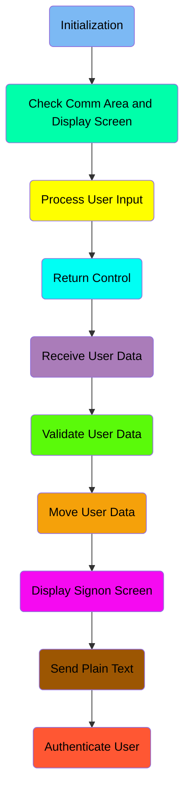

## Initialization

First, we'll zoom into this section of the flow:

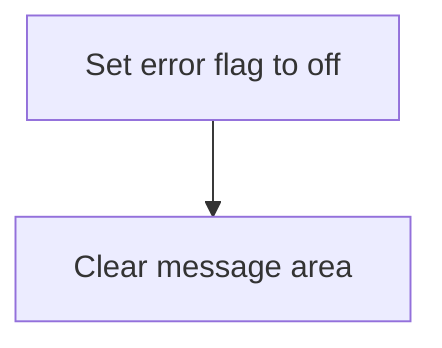

<SwmSnippet path="/app/cbl/COSGN00C.cbl" line="75">

---

First, the error flag is set to off, indicating that there are no errors currently present. This is done to ensure that any previous error states are cleared before proceeding with the next operations.

```cobol
           SET ERR-FLG-OFF TO TRUE
```

---

</SwmSnippet>

<SwmSnippet path="/app/cbl/COSGN00C.cbl" line="77">

---

Next, the message area is cleared by moving spaces to the <SwmToken path="app/cbl/COSGN00C.cbl" pos="77:7:9" line-data="           MOVE SPACES TO WS-MESSAGE">`WS-MESSAGE`</SwmToken> variable. This step ensures that any previous messages are removed, providing a clean slate for any new messages that need to be displayed to the user.

```cobol
           MOVE SPACES TO WS-MESSAGE
                          ERRMSGO OF COSGN0AO
```

---

</SwmSnippet>

## Check Comm Area and Display Screen

Now, lets zoom into this section of the flow:

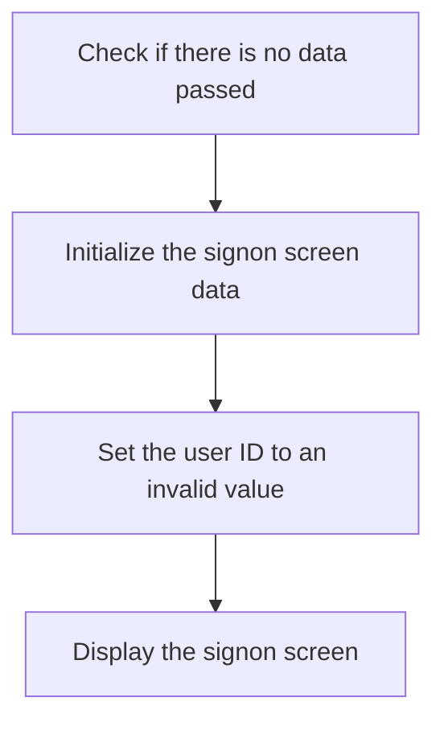

The first step is to check if there is no data passed by evaluating if <SwmToken path="app/cbl/COSGN00C.cbl" pos="67:15:15" line-data="             OCCURS 1 TO 32767 TIMES DEPENDING ON EIBCALEN.">`EIBCALEN`</SwmToken> (which holds the length of the communication area) is equal to 0. If this condition is true, it indicates that no data was passed to the program.

Next, the signon screen data is initialized by moving <SwmToken path="app/cbl/COSGN00C.cbl" pos="118:15:17" line-data="               WHEN USERIDI OF COSGN0AI = SPACES OR LOW-VALUES">`LOW-VALUES`</SwmToken> to <SwmToken path="app/cbl/COSGN00C.cbl" pos="78:5:5" line-data="                          ERRMSGO OF COSGN0AO">`COSGN0AO`</SwmToken> (which holds the output record for the signon screen). This ensures that the screen is cleared and ready for new data.

Then, the user ID is set to an invalid value by moving <SwmToken path="app/cbl/COSGN00C.cbl" pos="121:3:4" line-data="                   MOVE -1       TO USERIDL OF COSGN0AI">`-1`</SwmToken> to <SwmToken path="app/cbl/COSGN00C.cbl" pos="121:8:12" line-data="                   MOVE -1       TO USERIDL OF COSGN0AI">`USERIDL OF COSGN0AI`</SwmToken> (which holds the user ID in the input record). This indicates that no valid user ID has been provided.

## Process User Input

Now, lets zoom into this section of the flow:

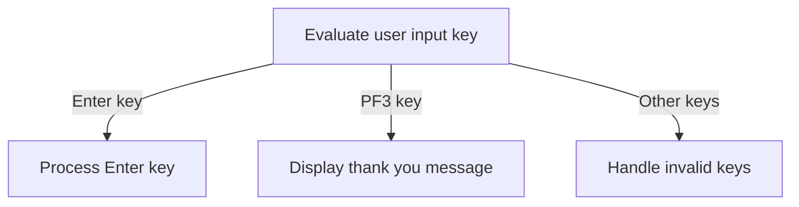

<SwmSnippet path="/app/cbl/COSGN00C.cbl" line="85">

---

The function evaluates the user input key to determine the appropriate action. If the Enter key is pressed, it processes the Enter key by performing the <SwmToken path="app/cbl/COSGN00C.cbl" pos="87:3:7" line-data="                       PERFORM PROCESS-ENTER-KEY">`PROCESS-ENTER-KEY`</SwmToken> routine. If the PF3 key is pressed, it moves a thank you message to <SwmToken path="app/cbl/COSGN00C.cbl" pos="89:13:15" line-data="                       MOVE CCDA-MSG-THANK-YOU        TO WS-MESSAGE">`WS-MESSAGE`</SwmToken> and performs the <SwmToken path="app/cbl/COSGN00C.cbl" pos="90:3:7" line-data="                       PERFORM SEND-PLAIN-TEXT">`SEND-PLAIN-TEXT`</SwmToken> routine to display the message. For any other key, it sets an error flag (<SwmToken path="app/cbl/COSGN00C.cbl" pos="92:9:13" line-data="                       MOVE &#39;Y&#39;                       TO WS-ERR-FLG">`WS-ERR-FLG`</SwmToken>) to 'Y', moves an invalid key message to <SwmToken path="app/cbl/COSGN00C.cbl" pos="89:13:15" line-data="                       MOVE CCDA-MSG-THANK-YOU        TO WS-MESSAGE">`WS-MESSAGE`</SwmToken>, and performs the <SwmToken path="app/cbl/COSGN00C.cbl" pos="94:3:7" line-data="                       PERFORM SEND-SIGNON-SCREEN">`SEND-SIGNON-SCREEN`</SwmToken> routine to prompt the user to try again.

```cobol
               EVALUATE EIBAID
                   WHEN DFHENTER
                       PERFORM PROCESS-ENTER-KEY
                   WHEN DFHPF3
                       MOVE CCDA-MSG-THANK-YOU        TO WS-MESSAGE
                       PERFORM SEND-PLAIN-TEXT
                   WHEN OTHER
                       MOVE 'Y'                       TO WS-ERR-FLG
                       MOVE CCDA-MSG-INVALID-KEY      TO WS-MESSAGE
                       PERFORM SEND-SIGNON-SCREEN
               END-EVALUATE
```

---

</SwmSnippet>

## Return Control

This is the next section of the flow.

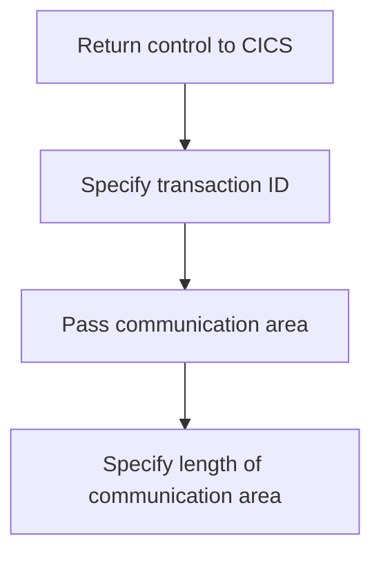

<SwmSnippet path="/app/cbl/COSGN00C.cbl" line="98">

---

First, the function returns control to the CICS region, ensuring that the application can continue processing other tasks or transactions.

```cobol
           EXEC CICS RETURN
```

---

</SwmSnippet>

<SwmSnippet path="/app/cbl/COSGN00C.cbl" line="99">

---

Next, it specifies the transaction ID (<SwmToken path="app/cbl/COSGN00C.cbl" pos="99:4:6" line-data="                     TRANSID (WS-TRANID)">`WS-TRANID`</SwmToken>) to indicate which transaction should be processed next. Then, it passes the communication area (<SwmToken path="app/cbl/COSGN00C.cbl" pos="100:4:6" line-data="                     COMMAREA (CARDDEMO-COMMAREA)">`CARDDEMO-COMMAREA`</SwmToken>) to share necessary data between different parts of the application. Finally, it specifies the length of the communication area to ensure that the correct amount of data is processed.

```cobol
                     TRANSID (WS-TRANID)
                     COMMAREA (CARDDEMO-COMMAREA)
                     LENGTH(LENGTH OF CARDDEMO-COMMAREA)
```

---

</SwmSnippet>

## Receive User Data

Now, lets zoom into this section of the flow:

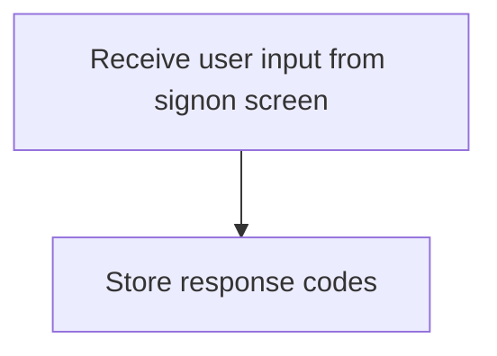

## Interim Summary

So far, we saw how the program initializes by setting the error flag to off and clearing the message area, checks the communication area and displays the signon screen, processes user input, and returns control to CICS. We also covered how the program receives user data from the signon screen. Now, we will focus on validating the user data to ensure that the User ID and Password are correctly entered before proceeding with the sign-on process.

## Validate User Data

Now, lets zoom into this section of the flow:

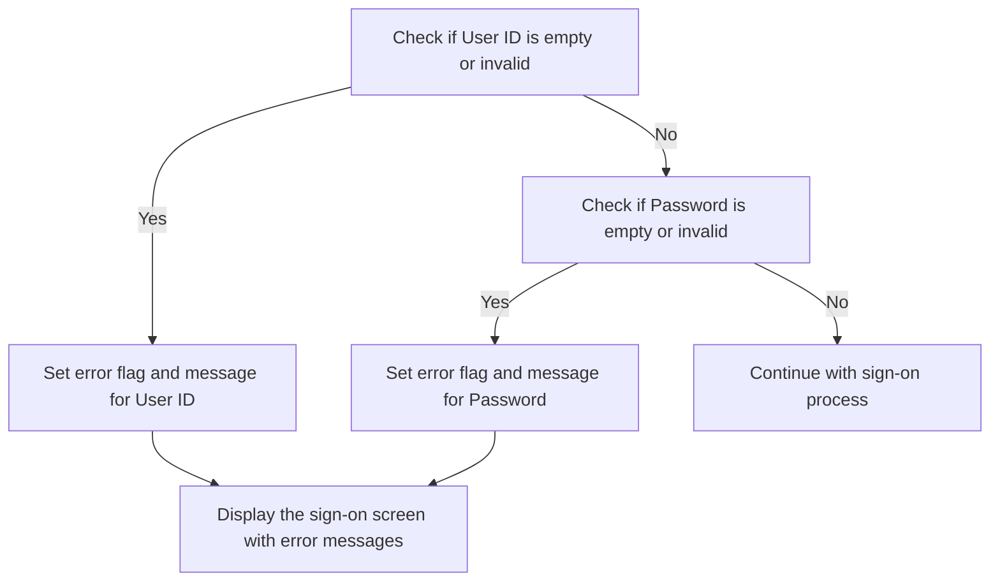

<SwmSnippet path="/app/cbl/COSGN00C.cbl" line="117">

---

The function begins by checking if the User ID is empty or contains invalid values. If the User ID is found to be empty or invalid, an error flag is set, and an appropriate error message is generated. The function then proceeds to check if the Password is empty or contains invalid values. If the Password is found to be empty or invalid, an error flag is set, and an appropriate error message is generated. In both cases of invalid User ID or Password, the sign-on screen is displayed again with the relevant error messages to prompt the user to enter the correct credentials.

```cobol
           EVALUATE TRUE
               WHEN USERIDI OF COSGN0AI = SPACES OR LOW-VALUES
                   MOVE 'Y'      TO WS-ERR-FLG
                   MOVE 'Please enter User ID ...' TO WS-MESSAGE
                   MOVE -1       TO USERIDL OF COSGN0AI
                   PERFORM SEND-SIGNON-SCREEN
               WHEN PASSWDI OF COSGN0AI = SPACES OR LOW-VALUES
                   MOVE 'Y'      TO WS-ERR-FLG
                   MOVE 'Please enter Password ...' TO WS-MESSAGE
                   MOVE -1       TO PASSWDL OF COSGN0AI
                   PERFORM SEND-SIGNON-SCREEN
               WHEN OTHER
                   CONTINUE
           END-EVALUATE.
```

---

</SwmSnippet>

## Move User Data

Now, lets zoom into this section of the flow:

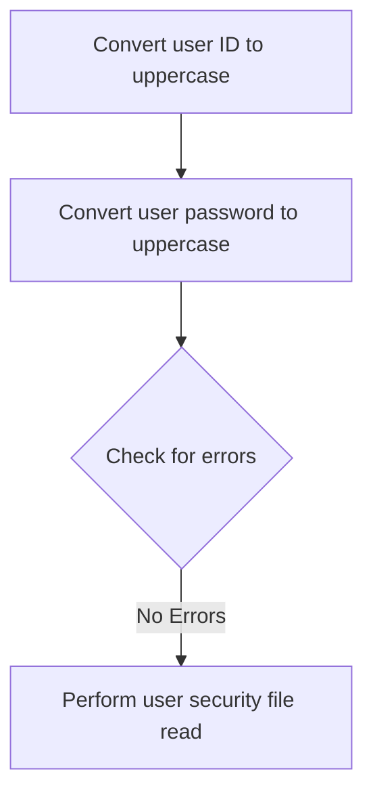

<SwmSnippet path="/app/cbl/COSGN00C.cbl" line="132">

---

First, the user ID is converted to uppercase to ensure consistency in the authentication process.

```cobol
           MOVE FUNCTION UPPER-CASE(USERIDI OF COSGN0AI) TO
                           WS-USER-ID
                           CDEMO-USER-ID
```

---

</SwmSnippet>

<SwmSnippet path="/app/cbl/COSGN00C.cbl" line="135">

---

Next, the user password is also converted to uppercase to match the stored credentials format.

```cobol
           MOVE FUNCTION UPPER-CASE(PASSWDI OF COSGN0AI) TO
                           WS-USER-PWD
```

---

</SwmSnippet>

## Display Signon Screen

Now, lets zoom into this section of the flow:

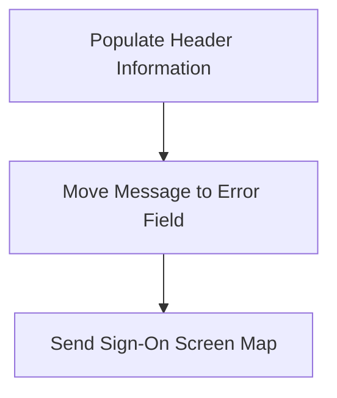

<SwmSnippet path="/app/cbl/COSGN00C.cbl" line="147">

---

First, we populate the header information to ensure that all necessary details are included in the sign-on screen.

```cobol
           PERFORM POPULATE-HEADER-INFO
```

---

</SwmSnippet>

<SwmSnippet path="/app/cbl/COSGN00C.cbl" line="149">

---

Next, we move the message to the error message field to display any relevant messages to the user.

```cobol
           MOVE WS-MESSAGE TO ERRMSGO OF COSGN0AO
```

---

</SwmSnippet>

<SwmSnippet path="/app/cbl/COSGN00C.cbl" line="151">

---

Then, we send the sign-on screen map to the user, ensuring that the screen is displayed correctly with the necessary information.

```cobol
           EXEC CICS SEND
                     MAP('COSGN0A')
                     MAPSET('COSGN00')
                     FROM(COSGN0AO)
                     ERASE
                     CURSOR
           END-EXEC.
```

---

</SwmSnippet>

## Send Plain Text

This is the next section of the flow.

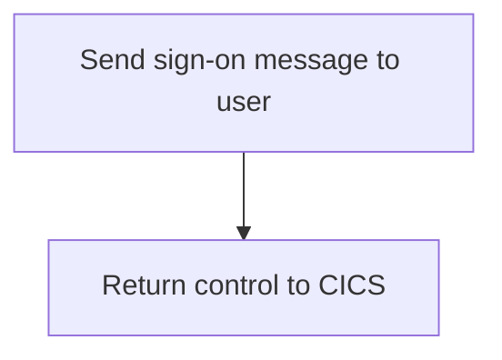

<SwmSnippet path="/app/cbl/COSGN00C.cbl" line="164">

---

First, the function sends the sign-on message to the user by using the <SwmToken path="app/cbl/COSGN00C.cbl" pos="164:5:7" line-data="           EXEC CICS SEND TEXT">`SEND TEXT`</SwmToken> command with the <SwmToken path="app/cbl/COSGN00C.cbl" pos="165:3:5" line-data="                     FROM(WS-MESSAGE)">`WS-MESSAGE`</SwmToken> (which holds the sign-on message content). This ensures that the user sees the appropriate sign-on screen message.

```cobol
           EXEC CICS SEND TEXT
                     FROM(WS-MESSAGE)
                     LENGTH(LENGTH OF WS-MESSAGE)
                     ERASE
                     FREEKB
           END-EXEC.
```

---

</SwmSnippet>

<SwmSnippet path="/app/cbl/COSGN00C.cbl" line="171">

---

Next, the function returns control to CICS using the `RETURN` command. This step is crucial as it hands back control to the CICS environment, allowing it to continue processing other tasks or user inputs.

```cobol
           EXEC CICS RETURN
           END-EXEC.
```

---

</SwmSnippet>

## Authenticate User

Now, lets zoom into this section of the flow:

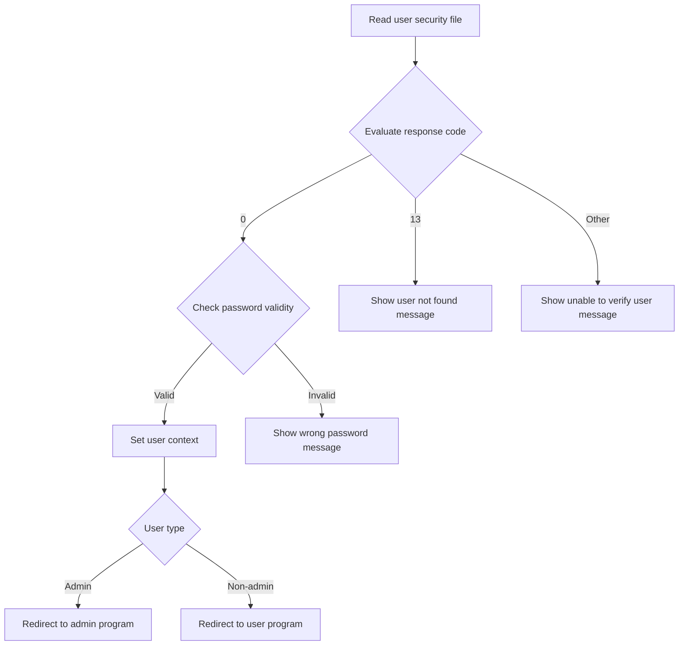

### Evaluate response code

<SwmSnippet path="/app/cbl/COSGN00C.cbl" line="221">

---

### Read user security file

First, the user security file is read to retrieve the user's security data, which includes their password and user type.

### Check password validity

Next, the response code from reading the user security file is evaluated to determine the next steps based on whether the read operation was successful or encountered an error.

### Set user context

If the response code indicates success, the provided password is checked against the stored password to verify the user's identity.

### Redirect based on user type

If the password is valid, the user's context is set by storing relevant information such as transaction ID, program name, user ID, and user type.

### Handle authentication errors

Based on the user type, the user is redirected to either the admin program or the general user program. This ensures that users access the appropriate functionality based on their role.

&nbsp;

```cobol
           EVALUATE WS-RESP-CD
               WHEN 0
                   IF SEC-USR-PWD = WS-USER-PWD
                       MOVE WS-TRANID    TO CDEMO-FROM-TRANID
                       MOVE WS-PGMNAME   TO CDEMO-FROM-PROGRAM
                       MOVE WS-USER-ID   TO CDEMO-USER-ID
                       MOVE SEC-USR-TYPE TO CDEMO-USER-TYPE
                       MOVE ZEROS        TO CDEMO-PGM-CONTEXT

                       IF CDEMO-USRTYP-ADMIN
                            EXEC CICS XCTL
                              PROGRAM ('COADM01C')
                              COMMAREA(CARDDEMO-COMMAREA)
                            END-EXEC
                       ELSE
                            EXEC CICS XCTL
                              PROGRAM ('COMEN01C')
                              COMMAREA(CARDDEMO-COMMAREA)
                            END-EXEC
                       END-IF
                   ELSE
                       MOVE 'Wrong Password. Try again ...' TO
                                                          WS-MESSAGE
                       MOVE -1       TO PASSWDL OF COSGN0AI
                       PERFORM SEND-SIGNON-SCREEN
                   END-IF
               WHEN 13
                   MOVE 'Y'      TO WS-ERR-FLG
                   MOVE 'User not found. Try again ...' TO WS-MESSAGE
                   MOVE -1       TO USERIDL OF COSGN0AI
                   PERFORM SEND-SIGNON-SCREEN
               WHEN OTHER
                   MOVE 'Y'      TO WS-ERR-FLG
                   MOVE 'Unable to verify the User ...' TO WS-MESSAGE
                   MOVE -1       TO USERIDL OF COSGN0AI
                   PERFORM SEND-SIGNON-SCREEN
           END-EVALUATE.
```

---

</SwmSnippet>

### 

*This is an auto-generated document by Swimm 🌊 and has not yet been verified by a human*

<SwmMeta version="3.0.0" repo-id="Z2l0aHViJTNBJTNBa3luZHJ5bC1hd3MtbWFpbmZyYW1lLW1vZGVybml6YXRpb24tY2FyZGRlbW8lM0ElM0FTd2ltbS1EZW1v" repo-name="kyndryl-aws-mainframe-modernization-carddemo"><sup>Powered by [Swimm](https://staging.swimm.cloud/)</sup></SwmMeta>
