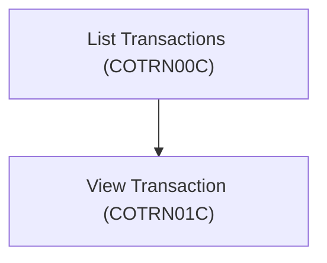
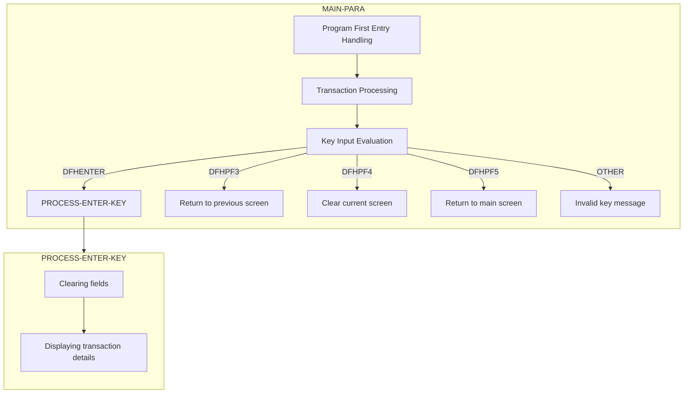

The document provides a detailed explanation of the <SwmToken path="/app/cbl/COTRN01C.cbl" pos="86:1:3" line-data="       MAIN-PARA." repo-id="Z2l0aHViJTNBJTNBa3luZHJ5bC1hd3MtbWFpbmZyYW1lLW1vZGVybml6YXRpb24tY2FyZGRlbW8lM0ElM0FTd2ltbS1EZW1v" repo-name="aws-mainframe-modernization-carddemo">`MAIN-PARA`</SwmToken> function and the <SwmToken path="/app/cbl/COTRN01C.cbl" pos="114:3:7" line-data="                           PERFORM PROCESS-ENTER-KEY" repo-id="Z2l0aHViJTNBJTNBa3luZHJ5bC1hd3MtbWFpbmZyYW1lLW1vZGVybml6YXRpb24tY2FyZGRlbW8lM0ElM0FTd2ltbS1EZW1v" repo-name="aws-mainframe-modernization-carddemo">`PROCESS-ENTER-KEY`</SwmToken> function within the program. These functions used for handling the entry point of the program and processing user inputs to view transaction details.

# Usages



# Program Drill Down



## Main Navigation and User Input Handling

The <SwmToken path="/app/cbl/COTRN01C.cbl" pos="86:1:3" line-data="       MAIN-PARA." repo-id="Z2l0aHViJTNBJTNBa3luZHJ5bC1hd3MtbWFpbmZyYW1lLW1vZGVybml6YXRpb24tY2FyZGRlbW8lM0ElM0FTd2ltbS1EZW1v" repo-name="aws-mainframe-modernization-carddemo">`MAIN-PARA`</SwmToken> function is responsible for setting the initial state and handling user inputs.

<SwmSnippet path="/app/cbl/COTRN01C.cbl" line="94" repo-id="Z2l0aHViJTNBJTNBa3luZHJ5bC1hd3MtbWFpbmZyYW1lLW1vZGVybml6YXRpb24tY2FyZGRlbW8lM0ElM0FTd2ltbS1EZW1v">

---

It starts by checking if <SwmToken path="/app/cbl/COTRN01C.cbl" pos="94:3:3" line-data="           IF EIBCALEN = 0" repo-id="Z2l0aHViJTNBJTNBa3luZHJ5bC1hd3MtbWFpbmZyYW1lLW1vZGVybml6YXRpb24tY2FyZGRlbW8lM0ElM0FTd2ltbS1EZW1v" repo-name="aws-mainframe-modernization-carddemo">`EIBCALEN`</SwmToken> is zero, which indicates that no data was passed to this program. If true, it calls the <SwmToken path="/app/cbl/COTRN01C.cbl" pos="96:3:9" line-data="               PERFORM RETURN-TO-PREV-SCREEN" repo-id="Z2l0aHViJTNBJTNBa3luZHJ5bC1hd3MtbWFpbmZyYW1lLW1vZGVybml6YXRpb24tY2FyZGRlbW8lM0ElM0FTd2ltbS1EZW1v" repo-name="aws-mainframe-modernization-carddemo">`RETURN-TO-PREV-SCREEN`</SwmToken> operation with <SwmToken path="/app/cbl/COTRN01C.cbl" pos="95:4:4" line-data="               MOVE &#39;COSGN00C&#39; TO CDEMO-TO-PROGRAM" repo-id="Z2l0aHViJTNBJTNBa3luZHJ5bC1hd3MtbWFpbmZyYW1lLW1vZGVybml6YXRpb24tY2FyZGRlbW8lM0ElM0FTd2ltbS1EZW1v" repo-name="aws-mainframe-modernization-carddemo">`COSGN00C`</SwmToken> in order to navigate to the sign-on screen.

```cobol
           IF EIBCALEN = 0
               MOVE 'COSGN00C' TO CDEMO-TO-PROGRAM
               PERFORM RETURN-TO-PREV-SCREEN
```

---

</SwmSnippet>

<SwmSnippet path="/app/cbl/COTRN01C.cbl" line="98" repo-id="Z2l0aHViJTNBJTNBa3luZHJ5bC1hd3MtbWFpbmZyYW1lLW1vZGVybml6YXRpb24tY2FyZGRlbW8lM0ElM0FTd2ltbS1EZW1v">

---

If not, the function checks if this is a first entry to the program (NOT <SwmToken path="/app/cbl/COTRN01C.cbl" pos="99:5:9" line-data="               IF NOT CDEMO-PGM-REENTER" repo-id="Z2l0aHViJTNBJTNBa3luZHJ5bC1hd3MtbWFpbmZyYW1lLW1vZGVybml6YXRpb24tY2FyZGRlbW8lM0ElM0FTd2ltbS1EZW1v" repo-name="aws-mainframe-modernization-carddemo">`CDEMO-PGM-REENTER`</SwmToken>). If so it initializes the screen. If a transaction was pre-selected (<SwmToken path="/app/cbl/COTRN01C.cbl" pos="103:3:9" line-data="                   IF CDEMO-CT01-TRN-SELECTED NOT =" repo-id="Z2l0aHViJTNBJTNBa3luZHJ5bC1hd3MtbWFpbmZyYW1lLW1vZGVybml6YXRpb24tY2FyZGRlbW8lM0ElM0FTd2ltbS1EZW1v" repo-name="aws-mainframe-modernization-carddemo">`CDEMO-CT01-TRN-SELECTED`</SwmToken>), it moves it to the input field processes it as if ENTER was pressed to show it.&nbsp;

```cobol
               MOVE DFHCOMMAREA(1:EIBCALEN) TO CARDDEMO-COMMAREA
               IF NOT CDEMO-PGM-REENTER
                   SET CDEMO-PGM-REENTER    TO TRUE
                   MOVE LOW-VALUES          TO COTRN1AO
                   MOVE -1       TO TRNIDINL OF COTRN1AI
                   IF CDEMO-CT01-TRN-SELECTED NOT =
                                              SPACES AND LOW-VALUES
                       MOVE CDEMO-CT01-TRN-SELECTED TO
                            TRNIDINI OF COTRN1AI
                       PERFORM PROCESS-ENTER-KEY
                   END-IF
                   PERFORM SEND-TRNVIEW-SCREEN
```

---

</SwmSnippet>

<SwmSnippet path="/app/cbl/COTRN01C.cbl" line="111" repo-id="Z2l0aHViJTNBJTNBa3luZHJ5bC1hd3MtbWFpbmZyYW1lLW1vZGVybml6YXRpb24tY2FyZGRlbW8lM0ElM0FTd2ltbS1EZW1v">

---

The <SwmToken path="/app/cbl/COTRN01C.cbl" pos="86:1:3" line-data="       MAIN-PARA." repo-id="Z2l0aHViJTNBJTNBa3luZHJ5bC1hd3MtbWFpbmZyYW1lLW1vZGVybml6YXRpb24tY2FyZGRlbW8lM0ElM0FTd2ltbS1EZW1v" repo-name="aws-mainframe-modernization-carddemo">`MAIN-PARA`</SwmToken> also processes the users input:&nbsp;

- If the user presses the Enter key (<SwmToken path="/app/cbl/COTRN01C.cbl" pos="113:3:3" line-data="                       WHEN DFHENTER" repo-id="Z2l0aHViJTNBJTNBa3luZHJ5bC1hd3MtbWFpbmZyYW1lLW1vZGVybml6YXRpb24tY2FyZGRlbW8lM0ElM0FTd2ltbS1EZW1v" repo-name="aws-mainframe-modernization-carddemo">`DFHENTER`</SwmToken>), it performs the <SwmToken path="/app/cbl/COTRN01C.cbl" pos="114:3:7" line-data="                           PERFORM PROCESS-ENTER-KEY" repo-id="Z2l0aHViJTNBJTNBa3luZHJ5bC1hd3MtbWFpbmZyYW1lLW1vZGVybml6YXRpb24tY2FyZGRlbW8lM0ElM0FTd2ltbS1EZW1v" repo-name="aws-mainframe-modernization-carddemo">`PROCESS-ENTER-KEY`</SwmToken> function to show the selected transaction.&nbsp;
- If the user presses the PF3 key (<SwmToken path="/app/cbl/COTRN00C.cbl" pos="122:3:3" line-data="                       WHEN DFHPF3" repo-id="Z2l0aHViJTNBJTNBa3luZHJ5bC1hd3MtbWFpbmZyYW1lLW1vZGVybml6YXRpb24tY2FyZGRlbW8lM0ElM0FTd2ltbS1EZW1v" repo-name="aws-mainframe-modernization-carddemo">`DFHPF3`</SwmToken>), it performs the <SwmToken path="/app/cbl/COTRN01C.cbl" pos="122:3:9" line-data="                           PERFORM RETURN-TO-PREV-SCREEN" repo-id="Z2l0aHViJTNBJTNBa3luZHJ5bC1hd3MtbWFpbmZyYW1lLW1vZGVybml6YXRpb24tY2FyZGRlbW8lM0ElM0FTd2ltbS1EZW1v" repo-name="aws-mainframe-modernization-carddemo">`RETURN-TO-PREV-SCREEN`</SwmToken> to navigate to the previous screen.
- If the user presses the `PF4` key (<SwmToken path="/app/cbl/COTRN01C.cbl" pos="123:3:3" line-data="                       WHEN DFHPF4" repo-id="Z2l0aHViJTNBJTNBa3luZHJ5bC1hd3MtbWFpbmZyYW1lLW1vZGVybml6YXRpb24tY2FyZGRlbW8lM0ElM0FTd2ltbS1EZW1v" repo-name="aws-mainframe-modernization-carddemo">`DFHPF4`</SwmToken>), it clears the screen.&nbsp;
- If the user presses the PF5 key (<SwmToken path="/app/cbl/COTRN01C.cbl" pos="125:3:3" line-data="                       WHEN DFHPF5" repo-id="Z2l0aHViJTNBJTNBa3luZHJ5bC1hd3MtbWFpbmZyYW1lLW1vZGVybml6YXRpb24tY2FyZGRlbW8lM0ElM0FTd2ltbS1EZW1v" repo-name="aws-mainframe-modernization-carddemo">`DFHPF5`</SwmToken>), it navigates to the <SwmToken path="/app/cbl/COTRN01C.cbl" pos="126:4:4" line-data="                           MOVE &#39;COTRN00C&#39; TO CDEMO-TO-PROGRAM" repo-id="Z2l0aHViJTNBJTNBa3luZHJ5bC1hd3MtbWFpbmZyYW1lLW1vZGVybml6YXRpb24tY2FyZGRlbW8lM0ElM0FTd2ltbS1EZW1v" repo-name="aws-mainframe-modernization-carddemo">`COTRN00C`</SwmToken> program which shows the transaction list.
- For any other input, it calls the <SwmToken path="/app/cbl/COTRN01C.cbl" pos="109:3:7" line-data="                   PERFORM SEND-TRNVIEW-SCREEN" repo-id="Z2l0aHViJTNBJTNBa3luZHJ5bC1hd3MtbWFpbmZyYW1lLW1vZGVybml6YXRpb24tY2FyZGRlbW8lM0ElM0FTd2ltbS1EZW1v" repo-name="aws-mainframe-modernization-carddemo">`SEND-TRNVIEW-SCREEN`</SwmToken> operation to show an error.

```
                   PERFORM RECEIVE-TRNVIEW-SCREEN
                   EVALUATE EIBAID
                       WHEN DFHENTER
                           PERFORM PROCESS-ENTER-KEY
                       WHEN DFHPF3
                           IF CDEMO-FROM-PROGRAM = SPACES OR LOW-VALUES
                               MOVE 'COMEN01C' TO CDEMO-TO-PROGRAM
                           ELSE
                               MOVE CDEMO-FROM-PROGRAM TO
                               CDEMO-TO-PROGRAM
                           END-IF
                           PERFORM RETURN-TO-PREV-SCREEN
                       WHEN DFHPF4
                           PERFORM CLEAR-CURRENT-SCREEN
                       WHEN DFHPF5
                           MOVE 'COTRN00C' TO CDEMO-TO-PROGRAM
                           PERFORM RETURN-TO-PREV-SCREEN
                       WHEN OTHER
                           MOVE 'Y'                       TO WS-ERR-FLG
                           MOVE CCDA-MSG-INVALID-KEY      TO WS-MESSAGE
                           PERFORM SEND-TRNVIEW-SCREEN
                   END-EVALUATE
```

---

</SwmSnippet>

<SwmSnippet path="/app/cbl/COTRN01C.cbl" line="146" repo-id="Z2l0aHViJTNBJTNBa3luZHJ5bC1hd3MtbWFpbmZyYW1lLW1vZGVybml6YXRpb24tY2FyZGRlbW8lM0ElM0FTd2ltbS1EZW1v">

---

## Transaction Viewing and Validation

The <SwmToken path="/app/cbl/COTRN01C.cbl" pos="114:3:7" line-data="                           PERFORM PROCESS-ENTER-KEY" repo-id="Z2l0aHViJTNBJTNBa3luZHJ5bC1hd3MtbWFpbmZyYW1lLW1vZGVybml6YXRpb24tY2FyZGRlbW8lM0ElM0FTd2ltbS1EZW1v" repo-name="aws-mainframe-modernization-carddemo">`PROCESS-ENTER-KEY`</SwmToken> function is called to show a transaction on the screen. It starts by validating the transaction ID (<SwmToken path="/app/cbl/COTRN01C.cbl" pos="147:3:3" line-data="               WHEN TRNIDINI OF COTRN1AI = SPACES OR LOW-VALUES" repo-id="Z2l0aHViJTNBJTNBa3luZHJ5bC1hd3MtbWFpbmZyYW1lLW1vZGVybml6YXRpb24tY2FyZGRlbW8lM0ElM0FTd2ltbS1EZW1v" repo-name="aws-mainframe-modernization-carddemo">`TRNIDINI`</SwmToken>).&nbsp;

```cobol
           EVALUATE TRUE
               WHEN TRNIDINI OF COTRN1AI = SPACES OR LOW-VALUES
                   MOVE 'Y'     TO WS-ERR-FLG
                   MOVE 'Tran ID can NOT be empty...' TO
                                   WS-MESSAGE
                   MOVE -1       TO TRNIDINL OF COTRN1AI
                   PERFORM SEND-TRNVIEW-SCREEN
               WHEN OTHER
                   MOVE -1       TO TRNIDINL OF COTRN1AI
                   CONTINUE
           END-EVALUATE
```

---

</SwmSnippet>

<SwmSnippet path="/app/cbl/COTRN01C.cbl" line="158" repo-id="Z2l0aHViJTNBJTNBa3luZHJ5bC1hd3MtbWFpbmZyYW1lLW1vZGVybml6YXRpb24tY2FyZGRlbW8lM0ElM0FTd2ltbS1EZW1v">

---

If no errors are found, the function performs the <SwmToken path="/app/cbl/COTRN01C.cbl" pos="173:3:7" line-data="               PERFORM READ-TRANSACT-FILE" repo-id="Z2l0aHViJTNBJTNBa3luZHJ5bC1hd3MtbWFpbmZyYW1lLW1vZGVybml6YXRpb24tY2FyZGRlbW8lM0ElM0FTd2ltbS1EZW1v" repo-name="aws-mainframe-modernization-carddemo">`READ-TRANSACT-FILE`</SwmToken> function to fetch the transaction details from the <SwmToken path="/app/cbl/COTRN01C.cbl" pos="173:5:5" line-data="               PERFORM READ-TRANSACT-FILE" repo-id="Z2l0aHViJTNBJTNBa3luZHJ5bC1hd3MtbWFpbmZyYW1lLW1vZGVybml6YXRpb24tY2FyZGRlbW8lM0ElM0FTd2ltbS1EZW1v" repo-name="aws-mainframe-modernization-carddemo">`TRANSACT`</SwmToken> file.

```cobol
           IF NOT ERR-FLG-ON
               MOVE SPACES      TO TRNIDI   OF COTRN1AI
                                   CARDNUMI OF COTRN1AI
                                   TTYPCDI  OF COTRN1AI
                                   TCATCDI  OF COTRN1AI
                                   TRNSRCI  OF COTRN1AI
                                   TRNAMTI  OF COTRN1AI
                                   TDESCI   OF COTRN1AI
                                   TORIGDTI OF COTRN1AI
                                   TPROCDTI OF COTRN1AI
                                   MIDI     OF COTRN1AI
                                   MNAMEI   OF COTRN1AI
                                   MCITYI   OF COTRN1AI
                                   MZIPI    OF COTRN1AI
               MOVE TRNIDINI  OF COTRN1AI TO TRAN-ID
               PERFORM READ-TRANSACT-FILE
           END-IF.
```

---

</SwmSnippet>

<SwmSnippet path="/app/cbl/COTRN01C.cbl" line="176" repo-id="Z2l0aHViJTNBJTNBa3luZHJ5bC1hd3MtbWFpbmZyYW1lLW1vZGVybml6YXRpb24tY2FyZGRlbW8lM0ElM0FTd2ltbS1EZW1v">

---

If the transaction is successfully fetched, the function maps the transaction details to the corresponding fields in <SwmToken path="/app/cbl/COTRN01C.cbl" pos="178:13:13" line-data="               MOVE TRAN-ID      TO TRNIDI    OF COTRN1AI" repo-id="Z2l0aHViJTNBJTNBa3luZHJ5bC1hd3MtbWFpbmZyYW1lLW1vZGVybml6YXRpb24tY2FyZGRlbW8lM0ElM0FTd2ltbS1EZW1v" repo-name="aws-mainframe-modernization-carddemo">`COTRN1AI`</SwmToken>. Then the function sends the transaction view screen by performing <SwmToken path="/app/cbl/COTRN01C.cbl" pos="191:3:7" line-data="               PERFORM SEND-TRNVIEW-SCREEN" repo-id="Z2l0aHViJTNBJTNBa3luZHJ5bC1hd3MtbWFpbmZyYW1lLW1vZGVybml6YXRpb24tY2FyZGRlbW8lM0ElM0FTd2ltbS1EZW1v" repo-name="aws-mainframe-modernization-carddemo">`SEND-TRNVIEW-SCREEN`</SwmToken> to display the fetched transaction details to the user.

```
           IF NOT ERR-FLG-ON
               MOVE TRAN-AMT TO WS-TRAN-AMT
               MOVE TRAN-ID      TO TRNIDI    OF COTRN1AI
               MOVE TRAN-CARD-NUM      TO CARDNUMI    OF COTRN1AI
               MOVE TRAN-TYPE-CD        TO TTYPCDI   OF COTRN1AI
               MOVE TRAN-CAT-CD        TO TCATCDI   OF COTRN1AI
               MOVE TRAN-SOURCE       TO TRNSRCI  OF COTRN1AI
               MOVE WS-TRAN-AMT      TO TRNAMTI    OF COTRN1AI
               MOVE TRAN-DESC      TO TDESCI    OF COTRN1AI
               MOVE TRAN-ORIG-TS        TO TORIGDTI   OF COTRN1AI
               MOVE TRAN-PROC-TS       TO TPROCDTI  OF COTRN1AI
               MOVE TRAN-MERCHANT-ID       TO MIDI  OF COTRN1AI
               MOVE TRAN-MERCHANT-NAME       TO MNAMEI  OF COTRN1AI
               MOVE TRAN-MERCHANT-CITY       TO MCITYI  OF COTRN1AI
               MOVE TRAN-MERCHANT-ZIP       TO MZIPI  OF COTRN1AI
               PERFORM SEND-TRNVIEW-SCREEN
           END-IF.
```

---

</SwmSnippet>

&nbsp;

*This is an auto-generated document by Swimm 🌊 and has not yet been verified by a human*

<SwmMeta version="3.0.0"><sup>Powered by [Swimm](https://app.swimm.io/)</sup></SwmMeta>
