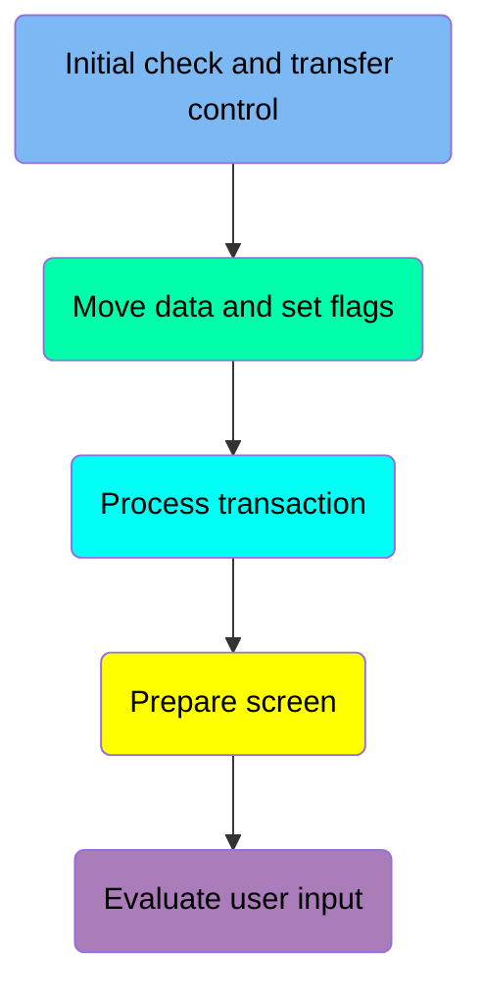
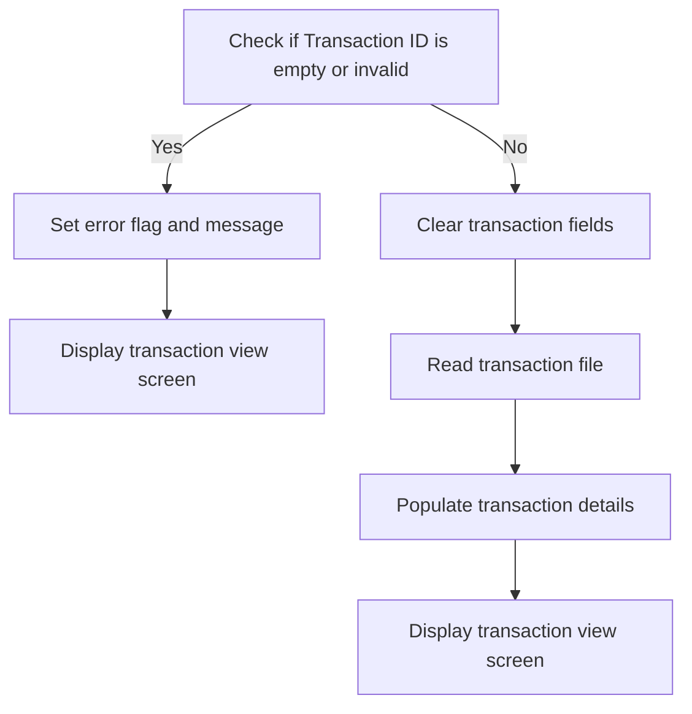
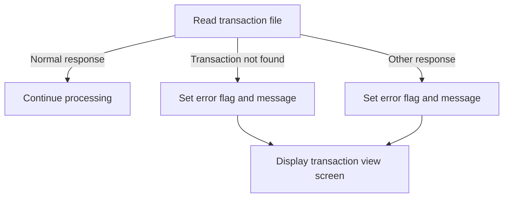

The <SwmToken path="app/cbl/COTRN01C.cbl" pos="2:7:7" line-data="      * Program     : COTRN01C.CBL">`COTRN01C`</SwmToken> program is a CICS COBOL program designed to view a transaction from the TRANSACT file. This document details the steps involved in processing a transaction view request, including initial checks, data movement, transaction processing, screen preparation, and user input evaluation.

For instance, when a user requests to view a transaction, the program first checks if the input data is empty and sets the next program accordingly. It then processes the transaction details and prepares the transaction view screen for display.

# View transaction (<SwmToken path="app/cbl/COTRN01C.cbl" pos="86:1:3" line-data="       MAIN-PARA.">`MAIN-PARA`</SwmToken>)

Let's split this section into smaller parts:



## Initial check and transfer control

<SwmSnippet path="/app/cbl/COTRN01C.cbl" line="94">

---

### Handling empty input data

Going into the snippet, the code checks if no data has been passed to the program. If this condition is met, it sets the next program to be executed to <SwmToken path="app/cbl/COTRN01C.cbl" pos="95:4:4" line-data="               MOVE &#39;COSGN00C&#39; TO CDEMO-TO-PROGRAM">`COSGN00C`</SwmToken> and transfers control back to the previous screen.

```cobol
           IF EIBCALEN = 0
               MOVE 'COSGN00C' TO CDEMO-TO-PROGRAM
               PERFORM RETURN-TO-PREV-SCREEN
```

---

</SwmSnippet>

## Move data and set flags

<SwmSnippet path="/app/cbl/COTRN01C.cbl" line="97">

---

### Handling re-entry logic

Going into the snippet, the code first checks if the communication area is not empty. If it is not empty, it moves the contents to the application's communication area. Then, it checks if the re-entry flag is not set. If it is not set, it sets the re-entry flag to true and initializes the transaction output area to low values.

```cobol
           ELSE
               MOVE DFHCOMMAREA(1:EIBCALEN) TO CARDDEMO-COMMAREA
               IF NOT CDEMO-PGM-REENTER
                   SET CDEMO-PGM-REENTER    TO TRUE
                   MOVE LOW-VALUES          TO COTRN1AO
```

---

</SwmSnippet>

## Process transaction

<SwmSnippet path="/app/cbl/COTRN01C.cbl" line="102">

---

Going into the snippet, the code first sets the transaction ID length to -1, indicating an uninitialized state. It then checks if the selected transaction ID is valid. If a valid transaction ID is selected, it proceeds to handle the transaction details.

```cobol
                   MOVE -1       TO TRNIDINL OF COTRN1AI
                   IF CDEMO-CT01-TRN-SELECTED NOT =
                                              SPACES AND LOW-VALUES
                       MOVE CDEMO-CT01-TRN-SELECTED TO
                            TRNIDINI OF COTRN1AI
                       PERFORM PROCESS-ENTER-KEY
                   END-IF
```

---

</SwmSnippet>

## Prepare screen

<SwmSnippet path="/app/cbl/COTRN01C.cbl" line="109">

---

### Displaying the Transaction View Screen

Going into the snippet, the code decides whether to display the transaction view screen or receive input from the user.

```cobol
                   PERFORM SEND-TRNVIEW-SCREEN
               ELSE
                   PERFORM RECEIVE-TRNVIEW-SCREEN
```

---

</SwmSnippet>

## Evaluate user input

Now, lets zoom into this section of the flow:

```mermaid
graph TD
  A[Evaluate user input] -->|Enter key pressed| B[Process transaction details]
  A -->|PF3 key pressed| C[Check source program]
  C -->|Source program is empty| D[Set next program to COMEN01C]
  C -->|Source program is not empty| E[Set next program to source program]
  A -->|PF4 key pressed| F[Clear current screen]
  A -->|PF5 key pressed| G[Set next program to COTRN00C]
  A -->|Other key pressed| H[Set error flag and message]
  H --> I[Display transaction view screen]

%% Swimm:
%% graph TD
%%   A[Evaluate user input] -->|Enter key pressed| B[Process transaction details]
%%   A -->|PF3 key pressed| C[Check source program]
%%   C -->|Source program is empty| D[Set next program to <SwmToken path="app/cbl/COTRN01C.cbl" pos="117:4:4" line-data="                               MOVE &#39;COMEN01C&#39; TO CDEMO-TO-PROGRAM">`COMEN01C`</SwmToken>]
%%   C -->|Source program is not empty| E[Set next program to source program]
%%   A -->|PF4 key pressed| F[Clear current screen]
%%   A -->|PF5 key pressed| G[Set next program to <SwmToken path="app/cbl/COTRN01C.cbl" pos="126:4:4" line-data="                           MOVE &#39;COTRN00C&#39; TO CDEMO-TO-PROGRAM">`COTRN00C`</SwmToken>]
%%   A -->|Other key pressed| H[Set error flag and message]
%%   H --> I[Display transaction view screen]
```



<SwmSnippet path="/app/cbl/COTRN01C.cbl" line="112">

---

### Handling Enter Key Press

Going into the first snippet, the code evaluates if the Enter key is pressed. If it is, the <SwmToken path="app/cbl/COTRN01C.cbl" pos="114:3:7" line-data="                           PERFORM PROCESS-ENTER-KEY">`PROCESS-ENTER-KEY`</SwmToken> function is performed to handle the transaction details, ensuring they are populated and displayed based on the transaction ID.

```cobol
                   EVALUATE EIBAID
                       WHEN DFHENTER
                           PERFORM PROCESS-ENTER-KEY
```

---

</SwmSnippet>

# Program Control Transfer (<SwmToken path="app/cbl/COTRN01C.cbl" pos="96:3:9" line-data="               PERFORM RETURN-TO-PREV-SCREEN">`RETURN-TO-PREV-SCREEN`</SwmToken>)

<SwmSnippet path="/app/cbl/COTRN01C.cbl" line="197">

---

### Setting the target program

Going into the first snippet, the code checks if the target program name is either uninitialized or empty. If it is, it sets the target program to <SwmToken path="app/cbl/COTRN01C.cbl" pos="200:4:4" line-data="               MOVE &#39;COSGN00C&#39; TO CDEMO-TO-PROGRAM">`COSGN00C`</SwmToken>, ensuring that there is always a valid program to return to.

```cobol
       RETURN-TO-PREV-SCREEN.

           IF CDEMO-TO-PROGRAM = LOW-VALUES OR SPACES
               MOVE 'COSGN00C' TO CDEMO-TO-PROGRAM
           END-IF
```

---

</SwmSnippet>

<SwmSnippet path="/app/cbl/COTRN01C.cbl" line="202">

---

### Transferring control to the target program

Next, the code sets the current transaction ID and program name, resets the program context, and then transfers control to the target program. This ensures that the application flow continues smoothly by passing the necessary context and control to the next program.

```cobol
           MOVE WS-TRANID    TO CDEMO-FROM-TRANID
           MOVE WS-PGMNAME   TO CDEMO-FROM-PROGRAM
           MOVE ZEROS        TO CDEMO-PGM-CONTEXT
           EXEC CICS
               XCTL PROGRAM(CDEMO-TO-PROGRAM)
               COMMAREA(CARDDEMO-COMMAREA)
           END-EXEC.
```

---

</SwmSnippet>

# Handle Enter Key Press (<SwmToken path="app/cbl/COTRN01C.cbl" pos="107:3:7" line-data="                       PERFORM PROCESS-ENTER-KEY">`PROCESS-ENTER-KEY`</SwmToken>)

Lets' zoom into the program flow:



<SwmSnippet path="/app/cbl/COTRN01C.cbl" line="144">

---

### Checking Transaction ID

Going into the first snippet, the code checks if the transaction ID is empty or invalid. If it is, it sets an error flag and a corresponding error message, then displays the transaction view screen with the error message.

```cobol
       PROCESS-ENTER-KEY.

           EVALUATE TRUE
               WHEN TRNIDINI OF COTRN1AI = SPACES OR LOW-VALUES
                   MOVE 'Y'     TO WS-ERR-FLG
                   MOVE 'Tran ID can NOT be empty...' TO
                                   WS-MESSAGE
                   MOVE -1       TO TRNIDINL OF COTRN1AI
                   PERFORM SEND-TRNVIEW-SCREEN
               WHEN OTHER
                   MOVE -1       TO TRNIDINL OF COTRN1AI
                   CONTINUE
           END-EVALUATE
```

---

</SwmSnippet>

<SwmSnippet path="/app/cbl/COTRN01C.cbl" line="158">

---

### Clearing Transaction Fields

Now, the second snippet clears various transaction fields if no error flag is set. It then reads the transaction file to retrieve the transaction details.

```cobol
           IF NOT ERR-FLG-ON
               MOVE SPACES      TO TRNIDI   OF COTRN1AI
                                   CARDNUMI OF COTRN1AI
                                   TTYPCDI  OF COTRN1AI
                                   TCATCDI  OF COTRN1AI
                                   TRNSRCI  OF COTRN1AI
                                   TRNAMTI  OF COTRN1AI
                                   TDESCI   OF COTRN1AI
                                   TORIGDTI OF COTRN1AI
                                   TPROCDTI OF COTRN1AI
                                   MIDI     OF COTRN1AI
                                   MNAMEI   OF COTRN1AI
                                   MCITYI   OF COTRN1AI
                                   MZIPI    OF COTRN1AI
               MOVE TRNIDINI  OF COTRN1AI TO TRAN-ID
               PERFORM READ-TRANSACT-FILE
           END-IF.
```

---

</SwmSnippet>

<SwmSnippet path="/app/cbl/COTRN01C.cbl" line="176">

---

### Populating Transaction Details

Next, the third snippet populates the transaction details into the respective fields if no error flag is set. It then displays the transaction view screen with the populated details.

```cobol
           IF NOT ERR-FLG-ON
               MOVE TRAN-AMT TO WS-TRAN-AMT
               MOVE TRAN-ID      TO TRNIDI    OF COTRN1AI
               MOVE TRAN-CARD-NUM      TO CARDNUMI    OF COTRN1AI
               MOVE TRAN-TYPE-CD        TO TTYPCDI   OF COTRN1AI
               MOVE TRAN-CAT-CD        TO TCATCDI   OF COTRN1AI
               MOVE TRAN-SOURCE       TO TRNSRCI  OF COTRN1AI
               MOVE WS-TRAN-AMT      TO TRNAMTI    OF COTRN1AI
               MOVE TRAN-DESC      TO TDESCI    OF COTRN1AI
               MOVE TRAN-ORIG-TS        TO TORIGDTI   OF COTRN1AI
               MOVE TRAN-PROC-TS       TO TPROCDTI  OF COTRN1AI
               MOVE TRAN-MERCHANT-ID       TO MIDI  OF COTRN1AI
               MOVE TRAN-MERCHANT-NAME       TO MNAMEI  OF COTRN1AI
               MOVE TRAN-MERCHANT-CITY       TO MCITYI  OF COTRN1AI
               MOVE TRAN-MERCHANT-ZIP       TO MZIPI  OF COTRN1AI
               PERFORM SEND-TRNVIEW-SCREEN
           END-IF.
```

---

</SwmSnippet>

# Display Transaction Screen (<SwmToken path="app/cbl/COTRN01C.cbl" pos="109:3:7" line-data="                   PERFORM SEND-TRNVIEW-SCREEN">`SEND-TRNVIEW-SCREEN`</SwmToken>)

<SwmSnippet path="/app/cbl/COTRN01C.cbl" line="213">

---

### Populating Header Information

Going into the <SwmToken path="app/cbl/COTRN01C.cbl" pos="213:1:5" line-data="       SEND-TRNVIEW-SCREEN.">`SEND-TRNVIEW-SCREEN`</SwmToken> function, the first step is to set up the necessary header details.

```cobol
       SEND-TRNVIEW-SCREEN.

           PERFORM POPULATE-HEADER-INFO
```

---

</SwmSnippet>

<SwmSnippet path="/app/cbl/COTRN01C.cbl" line="217">

---

### Sending the Transaction View Screen

Next, the function prepares the error message field and sends the transaction view screen to the user, ensuring the screen is cleared and the cursor is positioned correctly.

```cobol
           MOVE WS-MESSAGE TO ERRMSGO OF COTRN1AO

           EXEC CICS SEND
                     MAP('COTRN1A')
                     MAPSET('COTRN01')
                     FROM(COTRN1AO)
                     ERASE
                     CURSOR
           END-EXEC.
```

---

</SwmSnippet>

# Populate Header Info (<SwmToken path="app/cbl/COTRN01C.cbl" pos="215:3:7" line-data="           PERFORM POPULATE-HEADER-INFO">`POPULATE-HEADER-INFO`</SwmToken>)

<SwmSnippet path="/app/cbl/COTRN01C.cbl" line="243">

---

### Populating transaction header information

Going into the <SwmToken path="app/cbl/COTRN01C.cbl" pos="243:1:5" line-data="       POPULATE-HEADER-INFO.">`POPULATE-HEADER-INFO`</SwmToken> function, it starts by setting the current date and time. It then populates various fields in the transaction header with titles, transaction ID, program name, and formatted current date and time. Specifically, it sets the titles, transaction ID, and program name, and formats the current date and time into the appropriate fields for the transaction header.

```cobol
       POPULATE-HEADER-INFO.

           MOVE FUNCTION CURRENT-DATE  TO WS-CURDATE-DATA

           MOVE CCDA-TITLE01           TO TITLE01O OF COTRN1AO
           MOVE CCDA-TITLE02           TO TITLE02O OF COTRN1AO
           MOVE WS-TRANID              TO TRNNAMEO OF COTRN1AO
           MOVE WS-PGMNAME             TO PGMNAMEO OF COTRN1AO

           MOVE WS-CURDATE-MONTH       TO WS-CURDATE-MM
           MOVE WS-CURDATE-DAY         TO WS-CURDATE-DD
           MOVE WS-CURDATE-YEAR(3:2)   TO WS-CURDATE-YY

           MOVE WS-CURDATE-MM-DD-YY    TO CURDATEO OF COTRN1AO

           MOVE WS-CURTIME-HOURS       TO WS-CURTIME-HH
           MOVE WS-CURTIME-MINUTE      TO WS-CURTIME-MM
           MOVE WS-CURTIME-SECOND      TO WS-CURTIME-SS

           MOVE WS-CURTIME-HH-MM-SS    TO CURTIMEO OF COTRN1AO.
```

---

</SwmSnippet>

# Read Transaction Record (<SwmToken path="app/cbl/COTRN01C.cbl" pos="173:3:7" line-data="               PERFORM READ-TRANSACT-FILE">`READ-TRANSACT-FILE`</SwmToken>)

Lets' zoom into the program flow:



<SwmSnippet path="/app/cbl/COTRN01C.cbl" line="267">

---

Going into the <SwmToken path="app/cbl/COTRN01C.cbl" pos="267:1:5" line-data="       READ-TRANSACT-FILE.">`READ-TRANSACT-FILE`</SwmToken> function, the code reads the transaction file to retrieve the transaction details based on the transaction ID. This step is crucial for viewing the transaction information.

```cobol
       READ-TRANSACT-FILE.

           EXEC CICS READ
                DATASET   (WS-TRANSACT-FILE)
                INTO      (TRAN-RECORD)
                LENGTH    (LENGTH OF TRAN-RECORD)
                RIDFLD    (TRAN-ID)
                KEYLENGTH (LENGTH OF TRAN-ID)
                UPDATE
                RESP      (WS-RESP-CD)
                RESP2     (WS-REAS-CD)
           END-EXEC.
```

---

</SwmSnippet>

<SwmSnippet path="/app/cbl/COTRN01C.cbl" line="280">

---

Next, the code evaluates the response from reading the transaction file. If the transaction is found, it continues processing. If the transaction is not found, it sets an error flag, updates the message to indicate the issue, and displays the transaction view screen with the error message. For any other response, it sets an error flag, updates the message to indicate an issue with looking up the transaction, and displays the transaction view screen with the error message.

```cobol
           EVALUATE WS-RESP-CD
               WHEN DFHRESP(NORMAL)
                   CONTINUE
               WHEN DFHRESP(NOTFND)
                   MOVE 'Y'     TO WS-ERR-FLG
                   MOVE 'Transaction ID NOT found...' TO
                                   WS-MESSAGE
                   MOVE -1       TO TRNIDINL OF COTRN1AI
                   PERFORM SEND-TRNVIEW-SCREEN
               WHEN OTHER
                   DISPLAY 'RESP:' WS-RESP-CD 'REAS:' WS-REAS-CD
                   MOVE 'Y'     TO WS-ERR-FLG
                   MOVE 'Unable to lookup Transaction...' TO
                                   WS-MESSAGE
                   MOVE -1       TO TRNIDINL OF COTRN1AI
                   PERFORM SEND-TRNVIEW-SCREEN
           END-EVALUATE.
```

---

</SwmSnippet>

# Display Transaction View (<SwmToken path="app/cbl/COTRN01C.cbl" pos="111:3:7" line-data="                   PERFORM RECEIVE-TRNVIEW-SCREEN">`RECEIVE-TRNVIEW-SCREEN`</SwmToken>)

<SwmSnippet path="/app/cbl/COTRN01C.cbl" line="230">

---

### Receiving user input

Going into the <SwmToken path="app/cbl/COTRN01C.cbl" pos="230:1:5" line-data="       RECEIVE-TRNVIEW-SCREEN.">`RECEIVE-TRNVIEW-SCREEN`</SwmToken> function, the code receives user input from the transaction view screen. It captures the input data and uses response codes to handle any potential issues during the receive operation.

```cobol
       RECEIVE-TRNVIEW-SCREEN.

           EXEC CICS RECEIVE
                     MAP('COTRN1A')
                     MAPSET('COTRN01')
                     INTO(COTRN1AI)
                     RESP(WS-RESP-CD)
                     RESP2(WS-REAS-CD)
           END-EXEC.
```

---

</SwmSnippet>

&nbsp;

*This is an auto-generated document by Swimm 🌊 and has not yet been verified by a human*

<SwmMeta version="3.0.0" repo-id="Z2l0aHViJTNBJTNBa3luZHJ5bC1hd3MtbWFpbmZyYW1lLW1vZGVybml6YXRpb24tY2FyZGRlbW8lM0ElM0FTd2ltbS1EZW1v" repo-name="kyndryl-aws-mainframe-modernization-carddemo"><sup>Powered by [Swimm](/)</sup></SwmMeta>
