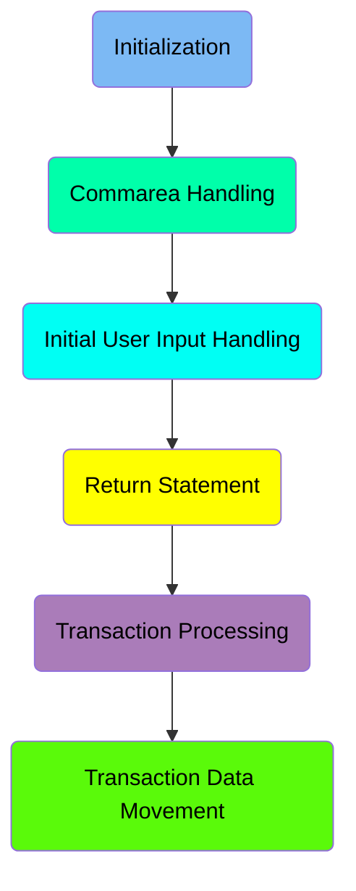
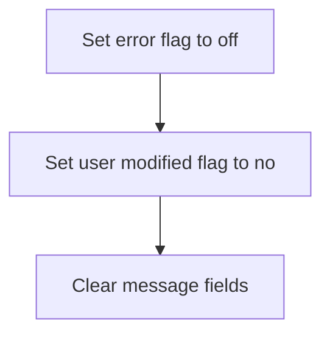
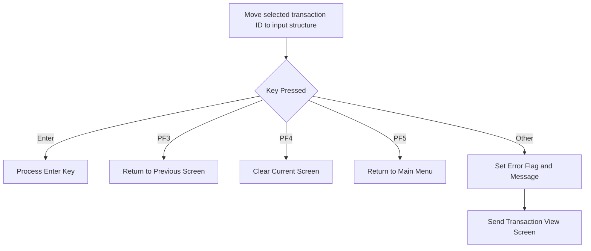
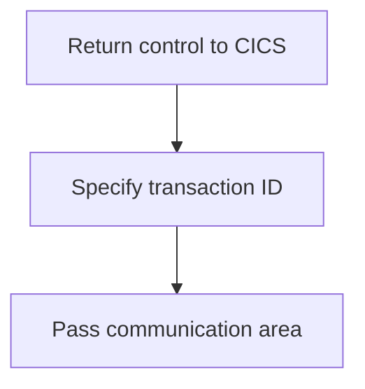
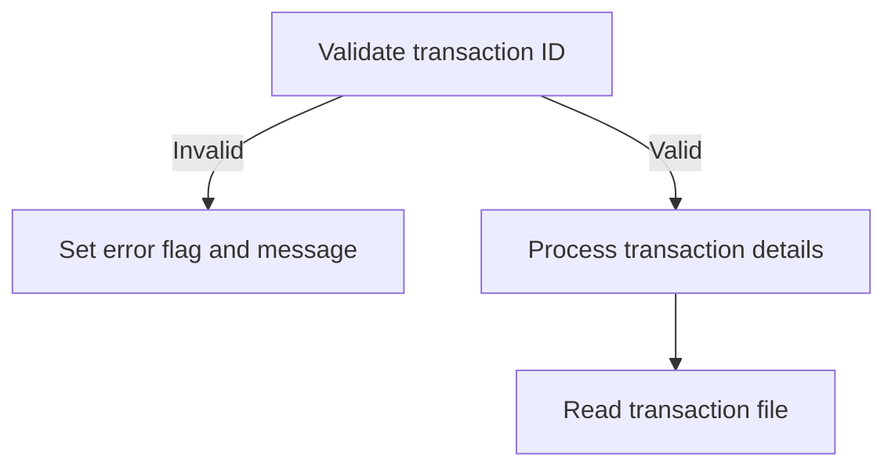
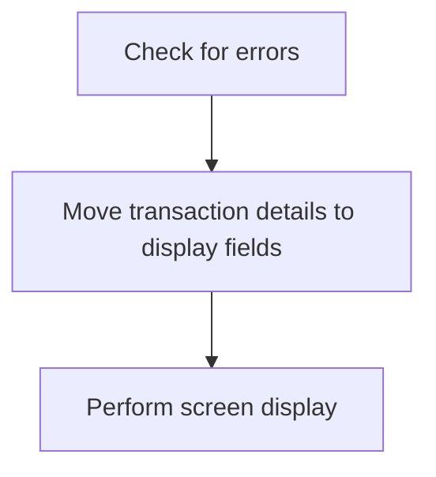

```mermaid
graph TD
  A[Check if communication area length is zero] --> |Yes| B[Set next program to COSGN00C] --> C[Return to previous screen]
  A --> |No| D[Move communication area data to local storage] --> E[Check if program is being re-entered]
  E --> |No| F[Set re-enter flag]
  F --> G[Initialize transaction view screen variables]
  E --> |Yes| G
  G --> H[Check if a transaction has been selected]

%% Swimm:
%% graph TD
%%   A[Check if communication area length is zero] --> |Yes| B[Set next program to <SwmToken path="app/cbl/COTRN01C.cbl" pos="95:4:4" line-data="               MOVE &#39;COSGN00C&#39; TO CDEMO-TO-PROGRAM">`COSGN00C`</SwmToken>] --> C[Return to previous screen]
%%   A --> |No| D[Move communication area data to local storage] --> E[Check if program is being re-entered]
%%   E --> |No| F[Set re-enter flag]
%%   F --> G[Initialize transaction view screen variables]
%%   E --> |Yes| G
%%   G --> H[Check if a transaction has been selected]
```

The document describes the role of the <SwmToken path="app/cbl/COTRN01C.cbl" pos="2:7:7" line-data="      * Program     : COTRN01C.CBL">`COTRN01C`</SwmToken> program in the <SwmToken path="app/cbl/COTRN01C.cbl" pos="3:7:7" line-data="      * Application : CardDemo">`CardDemo`</SwmToken> application. The program is responsible for viewing a transaction from the TRANSACT file. This is achieved by handling user inputs, processing transaction details, and displaying the transaction data on the screen.

The flow involves initializing the program, handling communication area data, processing user inputs, validating and processing transaction details, and finally displaying the transaction data.

Here is a high level diagram of the program:



## Initialization

First, we'll zoom into this section of the flow:



<SwmSnippet path="/app/cbl/COTRN01C.cbl" line="88">

---

First, we set the error flag to off (<SwmToken path="app/cbl/COTRN01C.cbl" pos="88:3:7" line-data="           SET ERR-FLG-OFF     TO TRUE">`ERR-FLG-OFF`</SwmToken>), indicating that there are no errors in the current operation.

```cobol
           SET ERR-FLG-OFF     TO TRUE
```

---

</SwmSnippet>

<SwmSnippet path="/app/cbl/COTRN01C.cbl" line="89">

---

Next, we set the user modified flag to no (<SwmToken path="app/cbl/COTRN01C.cbl" pos="89:3:7" line-data="           SET USR-MODIFIED-NO TO TRUE">`USR-MODIFIED-NO`</SwmToken>), indicating that the user's record has not been modified.

```cobol
           SET USR-MODIFIED-NO TO TRUE
```

---

</SwmSnippet>

## Commarea Handling

Now, lets zoom into this section of the flow:



<SwmSnippet path="/app/cbl/COTRN01C.cbl" line="94">

---

The first step is to check if the communication area length (<SwmToken path="app/cbl/COTRN01C.cbl" pos="94:3:3" line-data="           IF EIBCALEN = 0">`EIBCALEN`</SwmToken>) is zero. If it is, the next program to be executed is set to <SwmToken path="app/cbl/COTRN01C.cbl" pos="95:4:4" line-data="               MOVE &#39;COSGN00C&#39; TO CDEMO-TO-PROGRAM">`COSGN00C`</SwmToken> and the system returns to the previous screen. This ensures that if there is no data in the communication area, the user is redirected appropriately.

```cobol
           IF EIBCALEN = 0
               MOVE 'COSGN00C' TO CDEMO-TO-PROGRAM
               PERFORM RETURN-TO-PREV-SCREEN
```

---

</SwmSnippet>

<SwmSnippet path="/app/cbl/COTRN01C.cbl" line="98">

---

If the communication area length is not zero, the data from the communication area is moved to the local storage (<SwmToken path="app/cbl/COTRN01C.cbl" pos="98:12:14" line-data="               MOVE DFHCOMMAREA(1:EIBCALEN) TO CARDDEMO-COMMAREA">`CARDDEMO-COMMAREA`</SwmToken>). This step is crucial for preserving the data that will be used in subsequent processing.

```cobol
               MOVE DFHCOMMAREA(1:EIBCALEN) TO CARDDEMO-COMMAREA
```

---

</SwmSnippet>

<SwmSnippet path="/app/cbl/COTRN01C.cbl" line="99">

---

Next, the program checks if it is being re-entered by evaluating the <SwmToken path="app/cbl/COTRN01C.cbl" pos="99:5:9" line-data="               IF NOT CDEMO-PGM-REENTER">`CDEMO-PGM-REENTER`</SwmToken> flag. If the program is not being re-entered, the flag is set to true. This helps in managing the state of the program and ensuring that certain initialization steps are only performed once.

```cobol
               IF NOT CDEMO-PGM-REENTER
                   SET CDEMO-PGM-REENTER    TO TRUE
```

---

</SwmSnippet>

<SwmSnippet path="/app/cbl/COTRN01C.cbl" line="101">

---

The transaction view screen variables are then initialized by setting <SwmToken path="app/cbl/COTRN01C.cbl" pos="101:9:9" line-data="                   MOVE LOW-VALUES          TO COTRN1AO">`COTRN1AO`</SwmToken> to low values and <SwmToken path="app/cbl/COTRN01C.cbl" pos="102:8:8" line-data="                   MOVE -1       TO TRNIDINL OF COTRN1AI">`TRNIDINL`</SwmToken> to -1. This prepares the screen for displaying transaction data.

```cobol
                   MOVE LOW-VALUES          TO COTRN1AO
                   MOVE -1       TO TRNIDINL OF COTRN1AI
```

---

</SwmSnippet>

<SwmSnippet path="/app/cbl/COTRN01C.cbl" line="103">

---

Finally, the program checks if a transaction has been selected by evaluating if <SwmToken path="app/cbl/COTRN01C.cbl" pos="103:3:9" line-data="                   IF CDEMO-CT01-TRN-SELECTED NOT =">`CDEMO-CT01-TRN-SELECTED`</SwmToken> is not equal to spaces or low values. This condition determines whether the program should proceed with displaying the selected transaction.

```cobol
                   IF CDEMO-CT01-TRN-SELECTED NOT =
                                              SPACES AND LOW-VALUES
```

---

</SwmSnippet>

## Initial User Input Handling

Now, lets zoom into this section of the flow:



<SwmSnippet path="/app/cbl/COTRN01C.cbl" line="105">

---

### Moving selected transaction ID to input structure

First, the selected transaction ID is moved to the input structure to prepare for further processing based on user interactions.

```cobol
                       MOVE CDEMO-CT01-TRN-SELECTED TO
                            TRNIDINI OF COTRN1AI
```

---

</SwmSnippet>

<SwmSnippet path="/app/cbl/COTRN01C.cbl" line="112">

---

### Performing actions based on key pressed by the user

Next, the program evaluates the key pressed by the user and performs corresponding actions. For example, if the Enter key is pressed, it processes the enter key logic. If PF3 is pressed, it returns to the previous screen, and if PF4 is pressed, it clears the current screen. Each key press triggers a specific action to manage the user interaction flow.

```cobol
                   EVALUATE EIBAID
                       WHEN DFHENTER
                           PERFORM PROCESS-ENTER-KEY
                       WHEN DFHPF3
                           IF CDEMO-FROM-PROGRAM = SPACES OR LOW-VALUES
                               MOVE 'COMEN01C' TO CDEMO-TO-PROGRAM
                           ELSE
                               MOVE CDEMO-FROM-PROGRAM TO
                               CDEMO-TO-PROGRAM
                           END-IF
                           PERFORM RETURN-TO-PREV-SCREEN
                       WHEN DFHPF4
                           PERFORM CLEAR-CURRENT-SCREEN
                       WHEN DFHPF5
                           MOVE 'COTRN00C' TO CDEMO-TO-PROGRAM
                           PERFORM RETURN-TO-PREV-SCREEN
```

---

</SwmSnippet>

<SwmSnippet path="/app/cbl/COTRN01C.cbl" line="128">

---

### Handling invalid key inputs

Then, if an invalid key is pressed, the program sets an error flag and assigns an error message. This ensures that the user is informed about the invalid input and the transaction view screen is updated accordingly.

```cobol
                       WHEN OTHER
                           MOVE 'Y'                       TO WS-ERR-FLG
                           MOVE CCDA-MSG-INVALID-KEY      TO WS-MESSAGE
                           PERFORM SEND-TRNVIEW-SCREEN
```

---

</SwmSnippet>

## Interim Summary

So far, we saw how the program handles initial user input, including moving the selected transaction ID to the input structure and performing actions based on the key pressed by the user. This ensures that the program can manage user interactions effectively. Now, we will focus on the return statement, where control is returned to the CICS region after processing the transaction view request.

## Return Statement

This is the next section of the flow.



After processing the transaction view request, we return control to the CICS region. This ensures that the system can continue handling other tasks and transactions efficiently.

We specify the transaction ID using <SwmToken path="app/cbl/COTRN01C.cbl" pos="37:3:5" line-data="         05 WS-TRANID                  PIC X(04) VALUE &#39;CT01&#39;.">`WS-TRANID`</SwmToken> (which holds the transaction identifier). This helps CICS identify the specific transaction context for subsequent operations.

## Transaction Processing

Now, lets zoom into this section of the flow:



<SwmSnippet path="/app/cbl/COTRN01C.cbl" line="146">

---

### Validate the transaction ID

First, the transaction ID is validated to ensure it is not empty or contains low-values. This is crucial because a valid transaction ID is necessary to proceed with processing the transaction details.

```cobol
           EVALUATE TRUE
               WHEN TRNIDINI OF COTRN1AI = SPACES OR LOW-VALUES
```

---

</SwmSnippet>

<SwmSnippet path="/app/cbl/COTRN01C.cbl" line="148">

---

### Handle error if transaction ID is invalid

Moving to the next step, if the transaction ID is found to be invalid, an error flag is set, and an appropriate error message is prepared. This ensures that the user is informed about the invalid transaction ID and the process is halted.

```cobol
                   MOVE 'Y'     TO WS-ERR-FLG
                   MOVE 'Tran ID can NOT be empty...' TO
                                   WS-MESSAGE
                   MOVE -1       TO TRNIDINL OF COTRN1AI
                   PERFORM SEND-TRNVIEW-SCREEN
```

---

</SwmSnippet>

<SwmSnippet path="/app/cbl/COTRN01C.cbl" line="158">

---

### Process transaction details if transaction ID is valid

Next, if the transaction ID is valid, the transaction details are processed. This involves clearing the relevant fields and moving the transaction ID to the appropriate variable. Finally, the transaction file is read to retrieve the transaction details.

```cobol
           IF NOT ERR-FLG-ON
               MOVE SPACES      TO TRNIDI   OF COTRN1AI
                                   CARDNUMI OF COTRN1AI
                                   TTYPCDI  OF COTRN1AI
                                   TCATCDI  OF COTRN1AI
                                   TRNSRCI  OF COTRN1AI
                                   TRNAMTI  OF COTRN1AI
                                   TDESCI   OF COTRN1AI
                                   TORIGDTI OF COTRN1AI
                                   TPROCDTI OF COTRN1AI
                                   MIDI     OF COTRN1AI
                                   MNAMEI   OF COTRN1AI
                                   MCITYI   OF COTRN1AI
                                   MZIPI    OF COTRN1AI
               MOVE TRNIDINI  OF COTRN1AI TO TRAN-ID
               PERFORM READ-TRANSACT-FILE
```

---

</SwmSnippet>

## Transaction Data Movement

Now, lets zoom into this section of the flow:



<SwmSnippet path="/app/cbl/COTRN01C.cbl" line="176">

---

First, we check if there are any errors by evaluating the error flag <SwmToken path="app/cbl/COTRN01C.cbl" pos="176:5:9" line-data="           IF NOT ERR-FLG-ON">`ERR-FLG-ON`</SwmToken>. If no errors are found, we proceed to move the transaction details to the respective fields for display. This includes moving the transaction amount, ID, card number, type code, category code, source, description, timestamps, merchant ID, name, city, and ZIP code to their corresponding fields in the display structure. Finally, we perform the screen display by calling the <SwmToken path="app/cbl/COTRN01C.cbl" pos="191:3:7" line-data="               PERFORM SEND-TRNVIEW-SCREEN">`SEND-TRNVIEW-SCREEN`</SwmToken> routine, which presents the transaction details to the user.

```cobol
           IF NOT ERR-FLG-ON
               MOVE TRAN-AMT TO WS-TRAN-AMT
               MOVE TRAN-ID      TO TRNIDI    OF COTRN1AI
               MOVE TRAN-CARD-NUM      TO CARDNUMI    OF COTRN1AI
               MOVE TRAN-TYPE-CD        TO TTYPCDI   OF COTRN1AI
               MOVE TRAN-CAT-CD        TO TCATCDI   OF COTRN1AI
               MOVE TRAN-SOURCE       TO TRNSRCI  OF COTRN1AI
               MOVE WS-TRAN-AMT      TO TRNAMTI    OF COTRN1AI
               MOVE TRAN-DESC      TO TDESCI    OF COTRN1AI
               MOVE TRAN-ORIG-TS        TO TORIGDTI   OF COTRN1AI
               MOVE TRAN-PROC-TS       TO TPROCDTI  OF COTRN1AI
               MOVE TRAN-MERCHANT-ID       TO MIDI  OF COTRN1AI
               MOVE TRAN-MERCHANT-NAME       TO MNAMEI  OF COTRN1AI
               MOVE TRAN-MERCHANT-CITY       TO MCITYI  OF COTRN1AI
               MOVE TRAN-MERCHANT-ZIP       TO MZIPI  OF COTRN1AI
               PERFORM SEND-TRNVIEW-SCREEN
           END-IF.
```

---

</SwmSnippet>

&nbsp;

*This is an auto-generated document by Swimm 🌊 and has not yet been verified by a human*

<SwmMeta version="3.0.0" repo-id="Z2l0aHViJTNBJTNBa3luZHJ5bC1hd3MtbWFpbmZyYW1lLW1vZGVybml6YXRpb24tY2FyZGRlbW8lM0ElM0FTd2ltbS1EZW1v" repo-name="kyndryl-aws-mainframe-modernization-carddemo"><sup>Powered by [Swimm](https://staging.swimm.cloud/)</sup></SwmMeta>
