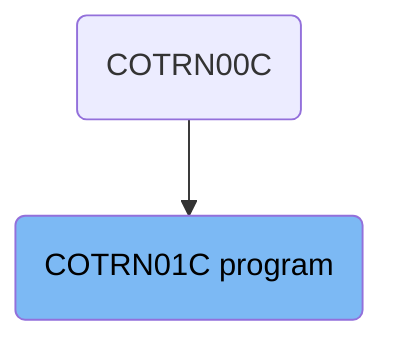
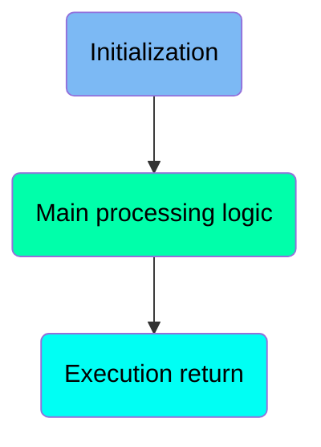
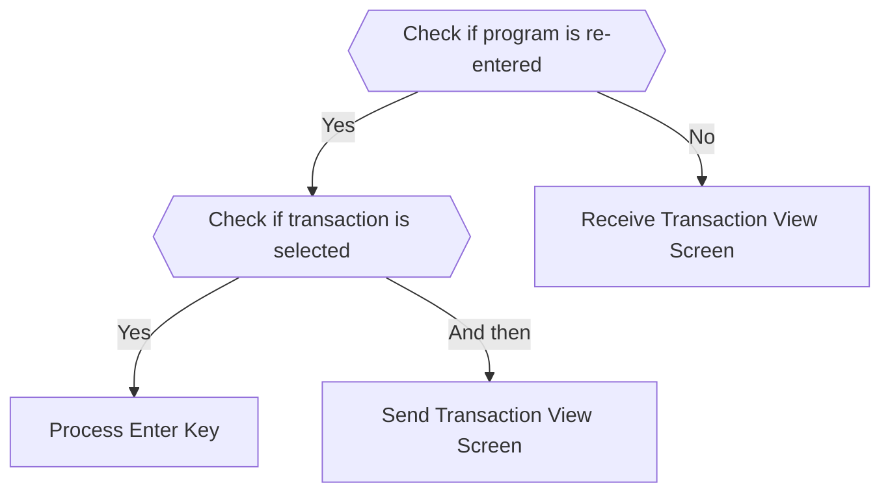
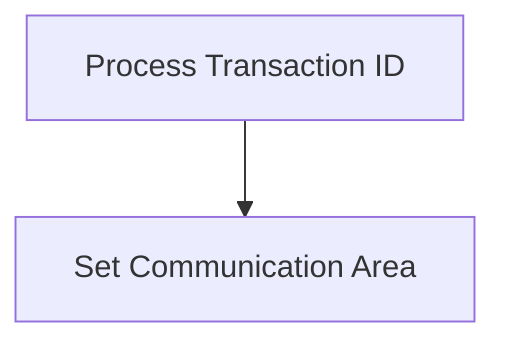

The <SwmToken path="app/cbl/COTRN01C.cbl" pos="2:7:7" line-data="      * Program     : COTRN01C.CBL">`COTRN01C`</SwmToken> program is designed to handle transaction processing within the <SwmToken path="app/cbl/COTRN01C.cbl" pos="3:7:7" line-data="      * Application : CardDemo">`CardDemo`</SwmToken> mainframe application. It initializes necessary variables, checks for re-entry, processes user inputs, and manages the flow of transaction screens. The program ensures smooth transaction handling by setting communication areas and processing transaction IDs.

The flow starts with initializing variables and checking if the program is being re-entered. If not, it sets the re-enter flag and initializes variables. It then checks if a transaction is selected and processes it accordingly. The program sends and receives transaction view screens based on user inputs and evaluates these inputs to perform actions like processing the enter key, returning to the previous screen, or handling invalid keys. Finally, it processes the transaction ID and sets the communication area for data exchange.

# Where is this program used?

This program is used multiple times in the codebase as represented in the following diagram:



Here is a high level diagram of the program:



# Initialization

```mermaid
graph TD
  A[Initialize MAIN-PARA] --> B[Set Error Flag Off]
  B --> C[Set User Modified No]
  C --> D[Clear WS-MESSAGE]
  D --> E[Clear ERRMSGO]
  E --> F{Check EIBCALEN}
  F -->|Yes| G[Move COSGN00C to CDEMO-TO-PROGRAM]
  G --> H[Perform RETURN-TO-PREV-SCREEN]
  F -->|No| I[Move DFHCOMMAREA to CARDDEMO-COMMAREA]

%% Swimm:
%% graph TD
%%   A[Initialize MAIN-PARA] --> B[Set Error Flag Off]
%%   B --> C[Set User Modified No]
%%   C --> D[Clear WS-MESSAGE]
%%   D --> E[Clear ERRMSGO]
%%   E --> F{Check EIBCALEN}
%%   F -->|Yes| G[Move <SwmToken path="app/cbl/COTRN01C.cbl" pos="95:4:4" line-data="               MOVE &#39;COSGN00C&#39; TO CDEMO-TO-PROGRAM">`COSGN00C`</SwmToken> to CDEMO-TO-PROGRAM]
%%   G --> H[Perform RETURN-TO-PREV-SCREEN]
%%   F -->|No| I[Move DFHCOMMAREA to CARDDEMO-COMMAREA]
```



<SwmSnippet path="/app/cbl/COTRN01C.cbl" line="86">

---

## Initialize <SwmToken path="app/cbl/COTRN01C.cbl" pos="86:1:3" line-data="       MAIN-PARA.">`MAIN-PARA`</SwmToken>

The <SwmToken path="app/cbl/COTRN01C.cbl" pos="86:1:3" line-data="       MAIN-PARA.">`MAIN-PARA`</SwmToken> section begins the main logic of the program.

```cobol
       MAIN-PARA.
```

---

</SwmSnippet>

<SwmSnippet path="/app/cbl/COTRN01C.cbl" line="88">

---

## Set Error Flag Off

First, the error flag is set to off, indicating that there are no errors at the start of the process.

```cobol
           SET ERR-FLG-OFF     TO TRUE
```

---

</SwmSnippet>

<SwmSnippet path="/app/cbl/COTRN01C.cbl" line="89">

---

## Set User Modified No

Next, the user modification status is set to no, indicating that the user has not made any modifications yet.

```cobol
           SET USR-MODIFIED-NO TO TRUE
```

---

</SwmSnippet>

<SwmSnippet path="/app/cbl/COTRN01C.cbl" line="91">

---

## Clear <SwmToken path="app/cbl/COTRN01C.cbl" pos="91:7:9" line-data="           MOVE SPACES TO WS-MESSAGE">`WS-MESSAGE`</SwmToken>

Then, the workspace message variable <SwmToken path="app/cbl/COTRN01C.cbl" pos="91:7:9" line-data="           MOVE SPACES TO WS-MESSAGE">`WS-MESSAGE`</SwmToken> is cleared to ensure no residual messages are present.

```cobol
           MOVE SPACES TO WS-MESSAGE
```

---

</SwmSnippet>

<SwmSnippet path="/app/cbl/COTRN01C.cbl" line="92">

---

## Clear ERRMSGO

The error message output <SwmToken path="app/cbl/COTRN01C.cbl" pos="92:1:1" line-data="                          ERRMSGO OF COTRN1AO">`ERRMSGO`</SwmToken> is also cleared to ensure no residual error messages are present.

```cobol
                          ERRMSGO OF COTRN1AO
```

---

</SwmSnippet>

<SwmSnippet path="/app/cbl/COTRN01C.cbl" line="94">

---

## Check EIBCALEN

Finally, the program checks if <SwmToken path="app/cbl/COTRN01C.cbl" pos="94:3:3" line-data="           IF EIBCALEN = 0">`EIBCALEN`</SwmToken> is zero. If it is, it moves <SwmToken path="app/cbl/COTRN01C.cbl" pos="95:4:4" line-data="               MOVE &#39;COSGN00C&#39; TO CDEMO-TO-PROGRAM">`COSGN00C`</SwmToken> to <SwmToken path="app/cbl/COTRN01C.cbl" pos="117:9:13" line-data="                               MOVE &#39;COMEN01C&#39; TO CDEMO-TO-PROGRAM">`CDEMO-TO-PROGRAM`</SwmToken> and performs <SwmToken path="app/cbl/COTRN01C.cbl" pos="122:3:9" line-data="                           PERFORM RETURN-TO-PREV-SCREEN">`RETURN-TO-PREV-SCREEN`</SwmToken>. If not, it moves <SwmToken path="app/cbl/COTRN01C.cbl" pos="78:3:3" line-data="       01  DFHCOMMAREA.">`DFHCOMMAREA`</SwmToken> to <SwmToken path="app/cbl/COTRN01C.cbl" pos="138:4:6" line-data="                     COMMAREA (CARDDEMO-COMMAREA)">`CARDDEMO-COMMAREA`</SwmToken>.

```cobol
           IF EIBCALEN = 0
```

---

</SwmSnippet>

# Main processing logic



<SwmSnippet path="/app/cbl/COTRN01C.cbl" line="99">

---

## Check if program is re-entered

First, the code checks if the program is being re-entered by evaluating the <SwmToken path="app/cbl/COTRN01C.cbl" pos="99:5:9" line-data="               IF NOT CDEMO-PGM-REENTER">`CDEMO-PGM-REENTER`</SwmToken> flag. If it is not re-entered, it sets the flag to true and initializes some variables.

```cobol
               IF NOT CDEMO-PGM-REENTER
                   SET CDEMO-PGM-REENTER    TO TRUE
```

---

</SwmSnippet>

<SwmSnippet path="/app/cbl/COTRN01C.cbl" line="103">

---

## Check if transaction is selected

Next, the code checks if a transaction has been selected by evaluating <SwmToken path="app/cbl/COTRN01C.cbl" pos="103:3:9" line-data="                   IF CDEMO-CT01-TRN-SELECTED NOT =">`CDEMO-CT01-TRN-SELECTED`</SwmToken>. If a transaction is selected, it moves the selected transaction ID to <SwmToken path="app/cbl/COTRN01C.cbl" pos="106:1:1" line-data="                            TRNIDINI OF COTRN1AI">`TRNIDINI`</SwmToken> and performs the <SwmToken path="app/cbl/COTRN01C.cbl" pos="107:3:7" line-data="                       PERFORM PROCESS-ENTER-KEY">`PROCESS-ENTER-KEY`</SwmToken> paragraph.

```cobol
                   IF CDEMO-CT01-TRN-SELECTED NOT =
                                              SPACES AND LOW-VALUES
                       MOVE CDEMO-CT01-TRN-SELECTED TO
                            TRNIDINI OF COTRN1AI
                       PERFORM PROCESS-ENTER-KEY
```

---

</SwmSnippet>

<SwmSnippet path="/app/cbl/COTRN01C.cbl" line="109">

---

## Send Transaction View Screen

Then, the code performs the <SwmToken path="app/cbl/COTRN01C.cbl" pos="109:3:7" line-data="                   PERFORM SEND-TRNVIEW-SCREEN">`SEND-TRNVIEW-SCREEN`</SwmToken> paragraph to send the transaction view screen to the user.

```cobol
                   PERFORM SEND-TRNVIEW-SCREEN
```

---

</SwmSnippet>

<SwmSnippet path="/app/cbl/COTRN01C.cbl" line="111">

---

## Receive Transaction View Screen

If the program is re-entered, the code performs the <SwmToken path="app/cbl/COTRN01C.cbl" pos="111:3:7" line-data="                   PERFORM RECEIVE-TRNVIEW-SCREEN">`RECEIVE-TRNVIEW-SCREEN`</SwmToken> paragraph to receive the transaction view screen input from the user.

```cobol
                   PERFORM RECEIVE-TRNVIEW-SCREEN
```

---

</SwmSnippet>

<SwmSnippet path="/app/cbl/COTRN01C.cbl" line="112">

---

## Evaluate User Input

The code then evaluates the user input (<SwmToken path="app/cbl/COTRN01C.cbl" pos="112:3:3" line-data="                   EVALUATE EIBAID">`EIBAID`</SwmToken>). Depending on the input, it performs different actions such as processing the enter key, returning to the previous screen, clearing the current screen, or handling invalid keys.

```cobol
                   EVALUATE EIBAID
                       WHEN DFHENTER
                           PERFORM PROCESS-ENTER-KEY
                       WHEN DFHPF3
                           IF CDEMO-FROM-PROGRAM = SPACES OR LOW-VALUES
                               MOVE 'COMEN01C' TO CDEMO-TO-PROGRAM
                           ELSE
                               MOVE CDEMO-FROM-PROGRAM TO
                               CDEMO-TO-PROGRAM
                           END-IF
                           PERFORM RETURN-TO-PREV-SCREEN
                       WHEN DFHPF4
                           PERFORM CLEAR-CURRENT-SCREEN
                       WHEN DFHPF5
                           MOVE 'COTRN00C' TO CDEMO-TO-PROGRAM
                           PERFORM RETURN-TO-PREV-SCREEN
                       WHEN OTHER
                           MOVE 'Y'                       TO WS-ERR-FLG
                           MOVE CCDA-MSG-INVALID-KEY      TO WS-MESSAGE
                           PERFORM SEND-TRNVIEW-SCREEN
                   END-EVALUATE
```

---

</SwmSnippet>

# Execution return

This is the next section of the flow.



<SwmSnippet path="/app/cbl/COTRN01C.cbl" line="137">

---

## Process Transaction ID

First, the transaction ID is processed using the <SwmToken path="app/cbl/COTRN01C.cbl" pos="137:1:1" line-data="                     TRANSID (WS-TRANID)">`TRANSID`</SwmToken> keyword. This step is crucial as it identifies the specific transaction being handled.

```cobol
                     TRANSID (WS-TRANID)
```

---

</SwmSnippet>

<SwmSnippet path="/app/cbl/COTRN01C.cbl" line="138">

---

## Set Communication Area

Next, the communication area is set using the <SwmToken path="app/cbl/COTRN01C.cbl" pos="138:1:1" line-data="                     COMMAREA (CARDDEMO-COMMAREA)">`COMMAREA`</SwmToken> keyword. This area is used to pass data between different parts of the application, ensuring that all necessary information is available for processing the transaction.

```cobol
                     COMMAREA (CARDDEMO-COMMAREA)
```

---

</SwmSnippet>

&nbsp;

*This is an auto-generated document by Swimm 🌊 and has not yet been verified by a human*

<SwmMeta version="3.0.0" repo-id="Z2l0aHViJTNBJTNBa3luZHJ5bC1hd3MtbWFpbmZyYW1lLW1vZGVybml6YXRpb24tY2FyZGRlbW8lM0ElM0FTd2ltbS1EZW1v" repo-name="kyndryl-aws-mainframe-modernization-carddemo"><sup>Powered by [Swimm](https://staging.swimm.cloud/)</sup></SwmMeta>
